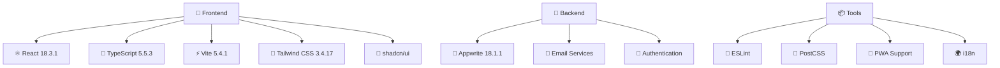

<div align="center">


# 📚 LingUBible

### *Let every review be a guiding light on your learning journey*

[](README.md)
[](docs/zh-TW/README.md)
[](docs/zh-CN/README.md)

[](https://reactjs.org/)
[](https://www.typescriptlang.org/)
[](https://vitejs.dev/)
[](https://tailwindcss.com/)
[](https://appwrite.io/)

[](https://opensource.org/licenses/MIT)
[](http://makeapullrequest.com)
[](https://github.com/ansonlo/campus-comment-verse/graphs/commit-activity)

---

**🌟 A course and lecturer review platform designed specifically for Lingnan University students**

*Helping students make informed academic choices and share authentic learning experiences*

[🚀 Get Started](#-quick-start) • [📖 Documentation](docs/) • [🤝 Contributing](#-contributing) • [🌍 Multi-language Support](#-language--語言)

</div>

---

## 📸 Project Preview

<div align="center">

### 🎨 Modern Interface Design
*Responsive design with dark/light theme support*

| 🌅 Light Theme | 🌙 Dark Theme |
|:---:|:---:|
|  |  |

### 📱 Multi-Device Support
*Perfect adaptation for desktop, tablet, and mobile*


### 🎯 Core Features Showcase

<table>
<tr>
<td align="center" width="25%">

<br><strong>Course Reviews</strong>
</td>
<td align="center" width="25%">

<br><strong>Lecturer Ratings</strong>
</td>
<td align="center" width="25%">

<br><strong>Smart Search</strong>
</td>
<td align="center" width="25%">

<br><strong>Multi-language Support</strong>
</td>
</tr>
</table>

</div>

---

## ✨ Core Features

<div align="center">

| Feature | Description | Status |
|:---:|:---|:---:|
| 📝 **Course Reviews** | Share detailed course learning experiences and recommendations | ✅ |
| 👨‍🏫 **Lecturer Ratings** | Evaluate teaching quality and teaching style | ✅ |
| 🔍 **Smart Search** | Quickly find course and lecturer information | ✅ |
| 🔐 **Secure Authentication** | Student email verification system | ✅ |
| 🌐 **Multi-language Support** | English, Traditional Chinese, Simplified Chinese | ✅ |
| 📱 **Responsive Design** | Support for all devices and screen sizes | ✅ |
| 🎨 **Modern UI** | Beautiful and intuitive user interface | ✅ |
| 🌙 **Theme Toggle** | Free switching between dark/light themes | ✅ |
| 📊 **Data Statistics** | Personal review statistics and achievement system | ✅ |
| 🔔 **Real-time Notifications** | Important updates and interaction reminders | ✅ |

</div>

---

## 🛠️ Technical Architecture

<div align="center">

### 🏗️ Tech Stack



### 🏛️ Project Architecture

```
📁 lingubible/
├── 🎨 src/                    # Source code
│   ├── 🧩 components/         # React components
│   ├── 📄 pages/              # Page components
│   ├── 🔧 services/           # API services
│   ├── 🎣 hooks/              # Custom Hooks
│   ├── 🛠️ utils/              # Utility functions
│   └── 📝 types/              # TypeScript types
├── 📚 docs/                   # Project documentation
├── 🛠️ tools/                  # Development tools
├── 🌐 public/                 # Static assets
└── ⚙️ functions/              # Cloud functions
```

### 📊 Performance Metrics

<table align="center">
<tr>
<td align="center">

<br><strong>Performance Score</strong>
</td>
<td align="center">

<br><strong>Bundle Size</strong>
</td>
<td align="center">

<br><strong>Load Time</strong>
</td>
<td align="center">

<br><strong>PWA Support</strong>
</td>
</tr>
</table>

</div>

---

## 🚀 Quick Start

### 📋 System Requirements

- **Node.js**: >= 18.0.0
- **npm**: >= 8.0.0 or **yarn**: >= 1.22.0
- **Git**: Latest version

### ⚡ Quick Installation

```bash
# 1️⃣ Clone the project
git clone https://github.com/ansonlo/campus-comment-verse.git
cd campus-comment-verse

# 2️⃣ Install dependencies
npm install
# or use yarn
yarn install

# 3️⃣ Environment setup
cp env.example .env.local

# 4️⃣ Start development server
npm run dev
# or use yarn
yarn dev
```

### 🔧 Environment Configuration

<details>
<summary>📝 Click to view detailed configuration steps</summary>

1. **Copy environment variable template**
   ```bash
   cp env.example .env.local
   ```

2. **Configure necessary environment variables**
   ```env
   # Appwrite configuration
   VITE_APPWRITE_ENDPOINT=your_appwrite_endpoint
   VITE_APPWRITE_PROJECT_ID=your_project_id
   VITE_APPWRITE_DATABASE_ID=your_database_id
   
   # Email service configuration
   VITE_EMAIL_SERVICE_ID=your_email_service_id
   
   # Other configurations...
   ```

3. **Refer to detailed setup guides**
   - [📖 Complete Setup Guide](docs/setup/)
   - [🔐 Authentication Configuration](docs/setup/authentication.md)
   - [📧 Email Service Setup](docs/setup/email-service.md)

</details>

### 🎯 Available Scripts

```bash
# 🚀 Development
npm run dev              # Start development server
npm run build            # Build production version
npm run preview          # Preview production build

# 🔍 Code Quality
npm run lint             # Code linting
npm run refactor:check   # Refactoring check

# 📚 Documentation
npm run docs:structure   # View documentation structure
npm run project:structure # View project structure

# 🛠️ Tools
npm run docs:setup       # Setup multi-language documentation
npm run refactor:update-imports # Update import paths
npm run readme:generate-assets  # Generate README assets
```

---

## 🌍 Language / 語言

<div align="center">

| Language | README | Documentation | Status |
|:---:|:---:|:---:|:---:|
| 🇺🇸 **English** | [README.md](README.md) | [Documentation](docs/) | ✅ Complete |
| �� **繁體中文** | [README.md](docs/zh-TW/README.md) | [文檔](docs/zh-TW/) | ✅ Complete |
| 🇨🇳 **简体中文** | [README.md](docs/zh-CN/README.md) | [文档](docs/zh-CN/) | ✅ Complete |

</div>

---

## 📖 Documentation Navigation

<div align="center">

### 📚 Complete Documentation Structure

| Category | Content | Link |
|:---:|:---|:---:|
| 🔧 **Setup Guide** | Environment configuration, dependency installation, deployment setup | [📖 Setup](docs/setup/) |
| ⚡ **Feature Documentation** | Core features, API usage, component introduction | [📖 Features](docs/features/) |
| 🚀 **Deployment Guide** | Production deployment, CI/CD, performance optimization | [📖 Deployment](docs/deployment/) |
| 🧪 **Testing Documentation** | Unit testing, integration testing, E2E testing | [📖 Testing](docs/testing/) |
| 🛠️ **Development Documentation** | Architecture design, refactoring records, development standards | [📖 Development](docs/development/) |

</div>

---

## 🤝 Contributing

<div align="center">

### 🌟 Welcome to contribute!

We welcome all forms of contributions, whether it's code, documentation, design, or idea sharing.

[](https://github.com/ansonlo/campus-comment-verse/graphs/contributors)

</div>

### 📝 Contribution Guide

1. **🍴 Fork the project**
2. **🌿 Create feature branch** (`git checkout -b feature/AmazingFeature`)
3. **💾 Commit changes** (`git commit -m 'Add some AmazingFeature'`)
4. **📤 Push to branch** (`git push origin feature/AmazingFeature`)
5. **🔄 Create Pull Request**

### 📋 Contribution Types

- 🐛 **Bug Fixes** - Help us fix issues
- ✨ **New Features** - Add useful new functionality
- 📝 **Documentation Improvements** - Enhance project documentation
- 🎨 **UI/UX Improvements** - Improve user experience
- 🌍 **Translations** - Support more languages
- 🧪 **Testing** - Increase test coverage

### 📖 Detailed Guides

- [🇺🇸 Contributing Guide (English)](docs/CONTRIBUTING.md)
- [�� 貢獻指南 (繁體中文)](docs/zh-TW/CONTRIBUTING.md)
- [🇨🇳 贡献指南 (简体中文)](docs/zh-CN/CONTRIBUTING.md)

---

## 📊 Project Statistics

<div align="center">


</div>

---

## 🏆 Acknowledgments

<div align="center">

### 💝 Special Thanks

**📚 LingUBible**'s success is inseparable from the following support:

| Category | Thanks to |
|:---:|:---|
| 🛠️ **Technical Support** | React, TypeScript, Vite, Tailwind CSS, Appwrite and other open source projects |
| 🎨 **Design Inspiration** | shadcn/ui, Radix UI, Lucide Icons and other design systems |
| 🌍 **Community Support** | GitHub, Stack Overflow, Reddit and other developer communities |
| 🎓 **User Feedback** | Valuable opinions and suggestions from Lingnan University student community |
| ❤️ **Development Team** | Hard work of all contributors and maintainers |

### 🌟 Open Source Spirit

This project adheres to the open source spirit and is committed to:
- 📖 **Knowledge Sharing** - Share technical experience and best practices
- 🤝 **Community Collaboration** - Welcome everyone to participate and contribute
- 🚀 **Continuous Improvement** - Continuously optimize and improve functionality
- 🌍 **Serving Society** - Contribute to education

</div>

---

## 📄 License

<div align="center">

**📜 MIT License**

This project is licensed under the [MIT License](LICENSE)

```
Copyright (c) 2024 LingUBible

Permission is hereby granted, free of charge, to any person obtaining a copy
of this software and associated documentation files (the "Software"), to deal
in the Software without restriction, including without limitation the rights
to use, copy, modify, merge, publish, distribute, sublicense, and/or sell
copies of the Software, and to permit persons to whom the Software is
furnished to do so, subject to the following conditions:

The above copyright notice and this permission notice shall be included in all
copies or substantial portions of the Software.
```

</div>

---

<div align="center">

### 🚀 Let's build a better learning environment together!

**⭐ If this project helps you, please give us a Star!**

[](https://github.com/ansonlo/campus-comment-verse/stargazers)

---

**🔗 Related Links**

[🌐 Official Website](https://lingubible.vercel.app) • 
[📧 Contact Us](mailto:contact@ansonlo.dev) • 
[💬 Discussions](https://github.com/ansonlo/campus-comment-verse/discussions) • 
[🐛 Issue Reports](https://github.com/ansonlo/campus-comment-verse/issues)

---

**⚠️ Disclaimer**

This website has no official affiliation with Lingnan University. All reviews and opinions are personal views of users and do not represent the position of Lingnan University.

---

*Built with ❤️ by [ansonlo.dev](https://ansonlo.dev) | Powered by Open Source*

</div> 