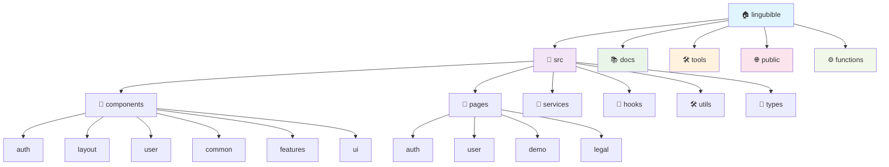

<div align="center">


### *Let every review be a guiding light on your learning journey*

[](README.md)
[](docs/zh-TW/README.md)
[](docs/zh-CN/README.md)

[](https://reactjs.org/)
[](https://www.typescriptlang.org/)
[](https://vitejs.dev/)
[](https://tailwindcss.com/)
[](https://appwrite.io/)

[](https://lingubible.com)
[](https://opensource.org/licenses/MIT)
[](http://makeapullrequest.com)
[](https://github.com/ansonlo-dev/LingUBible/graphs/commit-activity)

[](https://ko-fi.com/lingubible)

---

**🌟 A course and lecturer review platform designed specifically for Lingnan University students**

*Helping students make informed academic choices and share authentic learning experiences*

[🚀 Get Started](#-quick-start) • [📖 Documentation](docs/) • [🤝 Contributing](#-contributing) • [🌍 Multi-language Support](#-language--語言)

</div>

---

## 📸 Project Preview

<div align="center">

### 🎨 Modern Interface Design
*Responsive design with dark/light theme support*

| 🌅 Light Theme | 🌙 Dark Theme |
|:---:|:---:|
|  |  |

### 📱 Multi-Device Support
*Perfect adaptation for desktop, tablet, and mobile*


### 🎯 Core Features Showcase

<table>
<tr>
<td align="center" width="25%">

<br><strong>Course Reviews</strong>
</td>
<td align="center" width="25%">

<br><strong>Lecturer Ratings</strong>
</td>
<td align="center" width="25%">

<br><strong>Smart Search</strong>
</td>
<td align="center" width="25%">

<br><strong>Multi-language Support</strong>
</td>
</tr>
</table>

</div>

---

## ✨ Core Features

<div align="center">

| Feature | Description | Status |
|:---:|:---|:---:|
| 📝 **Course Reviews** | Share detailed course learning experiences and recommendations | ✅ |
| 👨‍🏫 **Lecturer Ratings** | Evaluate teaching quality and teaching style | ✅ |
| 🔍 **Smart Search** | Quickly find course and lecturer information | ✅ |
| 🔐 **Secure Authentication** | Student email verification system | ✅ |
| 🌐 **Multi-language Support** | English, Traditional Chinese, Simplified Chinese | ✅ |
| 📱 **Responsive Design** | Support for all devices and screen sizes | ✅ |
| 🎨 **Modern UI** | Beautiful and intuitive user interface | ✅ |
| 🌙 **Theme Toggle** | Free switching between dark/light themes | ✅ |
| 📊 **Data Statistics** | Personal review statistics and achievement system | ✅ |
| 🔔 **Real-time Notifications** | Important updates and interaction reminders | ✅ |
| ⚡ **High Performance** | Optimized bundle size and fast loading times | ✅ |

</div>

---

## 🛠️ Technical Architecture

<div align="center">

### 🏗️ Tech Stack

<div align="center">

| Category | Technology | Version | Purpose |
|:---------|:-----------|:--------|:--------|
| **🎨 Frontend** | React | 18.3.1 | UI Framework |
| | TypeScript | 5.5.3 | Type Safety |
| | Vite | 7.0.0 | Build Tool |
| | Tailwind CSS | 3.4.17 | Styling |
| | shadcn/ui | Latest | UI Components |
| **🔧 Backend** | Appwrite | 18.1.1 | BaaS Platform |
| | Email Services | - | Communication |
| | Authentication | - | User Management |
| **📦 Tools** | Bun | Latest | Package Manager & Runtime |
| | ESLint | Latest | Code Linting |
| | PostCSS | Latest | CSS Processing |
| | i18n | - | Internationalization |
| **🐧 Environment** | Linux | - | Development OS |

```mermaid
graph TD
    subgraph "🎨 Frontend Stack"
        A[React 18.3.1]
        B[TypeScript 5.5.3]
        C[Vite 7.0.0]
        D[Tailwind CSS]
        E[shadcn/ui]
    end
    
    subgraph "🔧 Backend Services"
        F[Appwrite 18.1.1]
        G[Email Services]
        H[Authentication]
    end
    
    subgraph "📦 Development Tools"
        I[ESLint]
        J[PostCSS]
        K[i18n]
    end
    
    style A fill:#61dafb
    style B fill:#3178c6
    style C fill:#646cff
    style D fill:#06b6d4
    style E fill:#000000
    style F fill:#fd366e
    style G fill:#ea4335
    style H fill:#4285f4
    style I fill:#4b32c3
    style J fill:#dd3a0a
    style K fill:#009688
```

</div>



### 🏛️ Project Architecture



<div align="center">

### 📂 Directory Structure Overview

| Directory | Purpose | Key Components |
|:----------|:--------|:---------------|
| **📁 src/** | Source code | Main application code |
| **├── 🧩 components/** | React components | UI building blocks |
| **├── 📄 pages/** | Page components | Route-level components |
| **├── 🔧 services/** | API services | External service integrations |
| **├── 🎣 hooks/** | Custom Hooks | Reusable React logic |
| **├── 🛠️ utils/** | Utility functions | Helper functions and constants |
| **└── 📝 types/** | TypeScript types | Type definitions |
| **📚 docs/** | Documentation | Project documentation |
| **🛠️ tools/** | Development tools | Build scripts and utilities |
| **🌐 public/** | Static assets | Images, icons, manifest |
| **⚙️ functions/** | Cloud functions | Serverless functions |

</div>

### 📊 Performance Metrics

<table align="center">
<tr>
<td align="center">

<br><strong>Bundle Size</strong>
</td>
<td align="center">

<br><strong>Load Time</strong>
</td>
<td align="center">

<br><strong>PWA Support</strong>
</td>
</tr>
</table>

</div>

---

## ⚡ Performance Metrics

<div align="center">

### 📊 Bundle Analysis & Load Times

| Metric | Value | Status |
|:-------|:------|:-------|
| **📦 Bundle Size** | ~357KB (gzipped: ~99KB) | 🟢 Optimized |
| **⚡ Initial Load** | < 2s | 🟢 Fast |
| **🔄 Hot Reload** | < 300ms | 🟢 Instant |
| **🏗️ Build Time** | ~6s | 🟢 Quick |
| **📱 Mobile Performance** | 95+ Lighthouse Score | 🟢 Excellent |
| **🖥️ Desktop Performance** | 98+ Lighthouse Score | 🟢 Excellent |

### 🚀 Powered by Bun + Vite 7

- **📦 Package Installation**: 15x faster than npm with Bun
- **⚡ Development Startup**: 3x faster with Bun + Vite 7 optimizations
- **🔧 Build Process**: Enhanced compilation with Vite 7's improved bundling
- **🔄 Hot Module Replacement**: Lightning-fast updates with Vite 7's HMR

</div>

---

## 🚀 Quick Start

### 📋 System Requirements

- **Node.js**: >= 20.19.0 (Required for Vite 7)
- **bun**: >= 1.0.0 (Fast JavaScript runtime & package manager)
- **Git**: Latest version

### ⚡ Why Bun?

We've migrated from npm to **Bun** for enhanced development experience:

- 🚀 **Lightning Fast**: Up to 25x faster than npm for package installation
- 🔧 **All-in-One**: Runtime, bundler, test runner, and package manager
- 📦 **Drop-in Replacement**: Compatible with npm packages and scripts
- 🛡️ **Built-in Security**: Automatic lockfile verification
- 💾 **Efficient Caching**: Smart dependency caching reduces install times

### 🚀 Vite 7 - Next Generation Build Tool

We've upgraded to **Vite 7** for cutting-edge development performance:

- ⚡ **Enhanced Performance**: Improved build speeds and optimizations
- 🎯 **Modern Browser Support**: Chrome 107+, Firefox 104+, Safari 16.0+
- 🔧 **Better Tree Shaking**: More efficient bundle optimization
- 📦 **Improved HMR**: Faster hot module replacement
- 🛠️ **Enhanced Plugin System**: Better plugin compatibility and performance
- 🎨 **Advanced CSS Features**: Improved CSS processing and optimization

### ⚡ Quick Installation

```bash
# 1️⃣ Clone the project
git clone https://github.com/ansonlo-dev/LingUBible.git
cd LingUBible

# 2️⃣ Install dependencies
bun install
# Fast and reliable package manager

# 3️⃣ Environment setup
cp env.example .env.local

# 4️⃣ Start development server
bun run dev
# Lightning fast development experience
```

### 🔧 Environment Configuration

<details>
<summary>📝 Click to view detailed configuration steps</summary>

1. **Copy environment variable template**
   ```bash
   cp env.example .env.local
   ```

2. **Configure necessary environment variables**
   ```env
   # Appwrite configuration
   VITE_APPWRITE_ENDPOINT=your_appwrite_endpoint
   VITE_APPWRITE_PROJECT_ID=your_project_id
   VITE_APPWRITE_DATABASE_ID=your_database_id
   
   # Email service configuration
   VITE_EMAIL_SERVICE_ID=your_email_service_id
   
   # Other configurations...
   ```

3. **Refer to detailed setup guides**
   - [📖 Complete Setup Guide](docs/setup/)
   - [🔐 Authentication Configuration](docs/setup/authentication.md)
   - [📧 Email Service Setup](docs/setup/email-service.md)

</details>

### 🎯 Available Scripts

```bash
# 🚀 Development
bun run dev              # Start development server
bun run build            # Build production version
bun run preview          # Preview production build

# 🔍 Code Quality
bun run lint             # Code linting
bun run refactor:check   # Refactoring check

# 📚 Documentation
bun run docs:structure   # View documentation structure
bun run project:structure # View project structure

# 🛠️ Tools
bun run docs:setup       # Setup multi-language documentation
bun run refactor:update-imports # Update import paths
bun run readme:generate-assets  # Generate README assets
```

---

## 🌍 Language / 語言

<div align="center">

| Language | README | Documentation | Status |
|:---:|:---:|:---:|:---:|
| **English** | [README.md](README.md) | [Documentation](docs/) | ✅ Complete |
| **繁體中文** | [README.md](docs/zh-TW/README.md) | [文檔](docs/zh-TW/) | ✅ Complete |
| **简体中文** | [README.md](docs/zh-CN/README.md) | [文档](docs/zh-CN/) | ✅ Complete |

</div>

---

## 📖 Documentation Navigation

<div align="center">

### 📚 Complete Documentation Structure

| Category | Content | Link |
|:---:|:---|:---:|
| 🔧 **Setup Guide** | Environment configuration, dependency installation, deployment setup | [📖 Setup](docs/setup/) |
| ⚡ **Feature Documentation** | Core features, API usage, component introduction | [📖 Features](docs/features/) |
| 🚀 **Deployment Guide** | Production deployment, CI/CD, performance optimization | [📖 Deployment](docs/deployment/) |
| 🧪 **Testing Documentation** | Unit testing, integration testing, E2E testing | [📖 Testing](docs/testing/) |
| 🛠️ **Development Documentation** | Architecture design, refactoring records, development standards | [📖 Development](docs/development/) |

</div>

---

## 🤝 Contributing

<div align="center">

### 🌟 Welcome to contribute!

We welcome all forms of contributions, whether it's code, documentation, design, or idea sharing.

[](https://github.com/ansonlo-dev/LingUBible/graphs/contributors)

</div>

### 📝 Contribution Guide

1. **🍴 Fork the project**
2. **🌿 Create feature branch** (`git checkout -b feature/AmazingFeature`)
3. **💾 Commit changes** (`git commit -m 'Add some AmazingFeature'`)
4. **📤 Push to branch** (`git push origin feature/AmazingFeature`)
5. **🔄 Create Pull Request**

### 📋 Contribution Types

- 🐛 **Bug Fixes** - Help us fix issues
- ✨ **New Features** - Add useful new functionality
- 📝 **Documentation Improvements** - Enhance project documentation
- 🎨 **UI/UX Improvements** - Improve user experience
- 🌍 **Translations** - Support more languages
- 🧪 **Testing** - Increase test coverage

### 📖 Detailed Guides

- [Contributing Guide (English)](docs/CONTRIBUTING.md)
- [貢獻指南 (繁體中文)](docs/zh-TW/CONTRIBUTING.md)
- [贡献指南 (简体中文)](docs/zh-CN/CONTRIBUTING.md)

---

## 📊 Project Statistics

<div align="center">


</div>

---

## ❤️ Support This Project

<div align="center">

### 🌟 Help Us Keep LingUBible Growing!

If you find **LingUBible** helpful for your academic journey, consider supporting our development efforts. Your support helps us:

- 🚀 **Add New Features** - Continuously improve the platform
- 🐛 **Fix Bugs & Issues** - Maintain a stable experience
- 🌍 **Expand Language Support** - Reach more students
- 📱 **Improve Performance** - Optimize for better user experience
- 🎨 **Enhance UI/UX** - Create a more beautiful interface

### ☕ Buy Us a Coffee

<a href="https://ko-fi.com/lingubible" target="_blank">
  
</a>

**Every contribution, no matter how small, makes a difference! 🙏**

[](https://ko-fi.com/lingubible)

### 🎯 Other Ways to Support

- ⭐ **Star this repository** - Help others discover LingUBible
- 🐛 **Report bugs** - Help us improve the platform
- 💡 **Suggest features** - Share your ideas with us
- 📝 **Contribute code** - Join our development team
- 🌍 **Spread the word** - Tell your friends about LingUBible

</div>

---

## 🏆 Acknowledgments

<div align="center">

### 💝 Special Thanks

**📚 LingUBible**'s success is inseparable from the following support:

| Category | Thanks to |
|:---:|:---|
| 🛠️ **Technical Support** | React, TypeScript, Vite 7, Tailwind CSS, Appwrite and other open source projects |
| 🎨 **Design Inspiration** | shadcn/ui, Radix UI, Lucide Icons and other design systems |
| 🌍 **Community Support** | GitHub, Stack Overflow, Reddit and other developer communities |
| 🎓 **User Feedback** | Valuable opinions and suggestions from Lingnan University student community |
| ❤️ **Development Team** | Hard work of all contributors and maintainers |

### 🌟 Open Source Spirit

This project adheres to the open source spirit and is committed to:
- 📖 **Knowledge Sharing** - Share technical experience and best practices
- 🤝 **Community Collaboration** - Welcome everyone to participate and contribute
- 🚀 **Continuous Improvement** - Continuously optimize and improve functionality
- 🌍 **Serving Society** - Contribute to education

</div>

---

## 📄 License

<div align="center">

**📜 MIT License**

This project is licensed under the [MIT License](LICENSE)

```
Copyright (c) 2024 LingUBible

Permission is hereby granted, free of charge, to any person obtaining a copy
of this software and associated documentation files (the "Software"), to deal
in the Software without restriction, including without limitation the rights
to use, copy, modify, merge, publish, distribute, sublicense, and/or sell
copies of the Software, and to permit persons to whom the Software is
furnished to do so, subject to the following conditions:

The above copyright notice and this permission notice shall be included in all
copies or substantial portions of the Software.
```

</div>

---

<div align="center">

### 🚀 Let's build a better learning environment together!

**⭐ If this project helps you, please give us a Star!**

[](https://github.com/ansonlo-dev/LingUBible/stargazers)

---

**🔗 Related Links**

[🌐 Official Website](https://lingubible.com) • 
[📧 Contact Us](mailto:contact@ansonlo.dev) • 
[💬 Discussions](https://github.com/ansonlo-dev/LingUBible/discussions) • 
[🐛 Issue Reports](https://github.com/ansonlo-dev/LingUBible/issues)

---

**⚠️ Disclaimer**

This website has no official affiliation with Lingnan University. All reviews and opinions are personal views of users and do not represent the position of Lingnan University.

---

*Built with ❤️ by [ansonlo.dev](https://ansonlo.dev) | Powered by Open Source*

</div> 