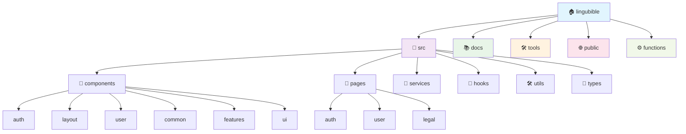

<div align="center">


### *Let every review be a guiding light on your learning journey*

[](README.md)
[](docs/zh-TW/README.md)
[](docs/zh-CN/README.md)

[](https://reactjs.org/)
[](https://www.typescriptlang.org/)
[](https://vitejs.dev/)
[](https://tailwindcss.com/)
[](https://appwrite.io/)
[](https://echarts.apache.org/)

[](https://lingubible.com)
[](https://opensource.org/licenses/MIT)
[](http://makeapullrequest.com)
[](https://github.com/ansonlo-dev/LingUBible/graphs/commit-activity)

[](https://ko-fi.com/lingubible)

---

**🌟 A course and lecturer review platform designed specifically for Lingnan University students**

*Helping students make informed academic choices and share authentic learning experiences*

[🚀 Get Started](#-quick-start) • [📖 Documentation](docs/) • [🤝 Contributing](#-contributing) • [🌍 Multi-language Support](#-language--語言)

</div>

---

## 🌐 Live Demo

<div align="center">

**LingUBible is live and serving Lingnan University students at:**

### [🔗 lingubible.com](https://lingubible.com)

*Browse courses and lecturers, read and write reviews, and explore interactive grade distributions — no installation required. Sign-up requires a valid Lingnan University email.*

</div>

---

## ✨ Core Features

<div align="center">

| Feature | Description | Status |
|:---:|:---|:---:|
| 📝 **Course Reviews** | Detailed reviews covering workload, difficulty, grade and teaching, with helpful/unhelpful voting | ✅ |
| 👨‍🏫 **Lecturer Reviews** | Per-instructor ratings broken down by teaching session (lecture / tutorial) | ✅ |
| 📊 **Interactive Grade Charts** | Grade distribution as bar, stacked and box-plot views (ECharts), with cumulative line, GPA, and N/A toggle | ✅ |
| 📄 **Past Exam Papers** | Browse, sort and filter past papers by year and instructor, with multi-select batch ZIP download | ✅ |
| 📑 **Course Syllabus** | View the latest course syllabus directly from the course page | ✅ |
| ⭐ **Favorites** | Save favourite courses and instructors for quick access | ✅ |
| 🔍 **Smart Search** | Fast course and lecturer search, including instructor nickname matching | ✅ |
| 🏛️ **Faculty & Department Badges** | Multi-department support for courses and instructors | ✅ |
| 🔐 **Student Verification** | Lingnan email verification, Google OAuth, and reCAPTCHA protection | ✅ |
| 🌐 **Multi-language Support** | English, Traditional Chinese, and Simplified Chinese | ✅ |
| 🏆 **Stats & Achievements** | Personal review statistics and an achievement system | ✅ |
| 📱 **PWA & Responsive** | Installable progressive web app that adapts to every screen size | ✅ |
| 🌙 **Theme Toggle** | Seamless switching between dark and light themes | ✅ |

</div>

---

## 🛠️ Technical Architecture

<div align="center">

### 🏗️ Tech Stack

<div align="center">

| Category | Technology | Version | Purpose |
|:---------|:-----------|:--------|:--------|
| **🎨 Frontend** | React | 18.3.1 | UI Framework |
| | TypeScript | 5.5.3 | Type Safety |
| | Vite | 7.0.0 | Build Tool |
| | Tailwind CSS | 3.4.17 | Styling |
| | shadcn/ui · Radix UI | Latest | UI Components |
| | ECharts | 5.6.0 | Data Visualization & Charts |
| | React Router | 6.26.2 | Routing |
| | TanStack Query | 5.56.2 | Data Fetching & Caching |
| | Zod | 3.23.8 | Schema Validation |
| **🔧 Backend** | Appwrite | 19.0.0 | BaaS (Auth, TablesDB, Storage, Functions) |
| | Resend | - | Transactional Email |
| | Google reCAPTCHA v3 | - | Bot Protection |
| **📦 Tools** | Bun | Latest | Package Manager & Runtime |
| | ESLint | Latest | Code Linting |
| | PostCSS | Latest | CSS Processing |
| | Custom i18n | - | Internationalization |

</div>


```mermaid
graph TD
    subgraph "🎨 Frontend Stack"
        A[React 18.3.1]
        B[TypeScript 5.5.3]
        C[Vite 7.0.0]
        D[Tailwind CSS]
        E[shadcn/ui]
    end
    
    subgraph "🔧 Backend Services"
        F[Appwrite 19.0.0]
        G[Resend Email]
        H[Auth & TablesDB]
    end
    
    subgraph "📦 Development Tools"
        I[ESLint]
        J[PostCSS]
        K[i18n]
    end
    
    style A fill:#61dafb
    style B fill:#3178c6
    style C fill:#646cff
    style D fill:#06b6d4
    style E fill:#000000
    style F fill:#fd366e
    style G fill:#ea4335
    style H fill:#4285f4
    style I fill:#4b32c3
    style J fill:#dd3a0a
    style K fill:#009688
```

### 🏛️ Project Architecture


```mermaid
graph TD
    A[🏠 lingubible] --> B[📁 src]
    A --> C[📚 docs]
    A --> D[🛠️ tools]
    A --> E[🌐 public]
    A --> F[⚙️ functions]
    
    B --> B1[🧩 components]
    B --> B2[📄 pages]
    B --> B3[🔧 services]
    B --> B4[🎣 hooks]
    B --> B5[🛠️ utils]
    B --> B6[📝 types]
    
    B1 --> B1A[auth]
    B1 --> B1B[layout]
    B1 --> B1C[user]
    B1 --> B1D[common]
    B1 --> B1E[features]
    B1 --> B1F[ui]
    
    B2 --> B2A[auth]
    B2 --> B2B[user]
    B2 --> B2D[legal]
    
    style A fill:#e1f5fe
    style B fill:#f3e5f5
    style C fill:#e8f5e8
    style D fill:#fff3e0
    style E fill:#fce4ec
    style F fill:#f1f8e9
```

<div align="center">

### 📂 Directory Structure Overview

| Directory | Purpose | Key Components |
|:----------|:--------|:---------------|
| **📁 src/** | Source code | Main application code |
| **├── 🧩 components/** | React components | UI building blocks |
| **├── 📄 pages/** | Page components | Route-level components |
| **├── 🔧 services/** | API services | External service integrations |
| **├── 🎣 hooks/** | Custom Hooks | Reusable React logic |
| **├── 🛠️ utils/** | Utility functions | Helper functions and constants |
| **└── 📝 types/** | TypeScript types | Type definitions |
| **📚 docs/** | Documentation | Project documentation |
| **🛠️ tools/** | Development tools | Build scripts and utilities |
| **🌐 public/** | Static assets | Images, icons, manifest |
| **⚙️ functions/** | Cloud functions | Serverless functions |

</div>

</div>

---

## ⚡ Performance & Optimization

<div align="center">

LingUBible is tuned to stay fast and responsive on Appwrite's infrastructure.

</div>

- **🧩 Code splitting** — vendor, UI, charts and locale code are split into separate chunks so the initial payload stays lean and rarely-used code loads on demand.
- **🗂️ Passive multi-layer caching** — in-memory + `localStorage` write-through TTL caches back the heavy aggregate reads (teaching records, term/language stats), serving repeat visits instantly without any background polling.
- **🔤 Font subsetting** — the LXGW WenKai CJK font is subset at build time to ship only the glyphs actually used.
- **🌍 Lazy-loaded locales** — each language bundle is dynamically imported only when selected.
- **⚡ Bun + Vite 7** — fast installs, near-instant dev startup, and snappy hot module replacement.

---

## 🚀 Quick Start

### 📋 System Requirements

- **Node.js**: >= 20.19.0 (Required for Vite 7)
- **bun**: >= 1.0.0 (Fast JavaScript runtime & package manager)
- **Git**: Latest version

### ⚡ Why Bun?

We've migrated from npm to **Bun** for enhanced development experience:

- 🚀 **Lightning Fast**: Up to 25x faster than npm for package installation
- 🔧 **All-in-One**: Runtime, bundler, test runner, and package manager
- 📦 **Drop-in Replacement**: Compatible with npm packages and scripts
- 🛡️ **Built-in Security**: Automatic lockfile verification
- 💾 **Efficient Caching**: Smart dependency caching reduces install times

### 🚀 Vite 7 - Next Generation Build Tool

We've upgraded to **Vite 7** for cutting-edge development performance:

- ⚡ **Enhanced Performance**: Improved build speeds and optimizations
- 🎯 **Modern Browser Support**: Chrome 107+, Firefox 104+, Safari 16.0+
- 🔧 **Better Tree Shaking**: More efficient bundle optimization
- 📦 **Improved HMR**: Faster hot module replacement
- 🛠️ **Enhanced Plugin System**: Better plugin compatibility and performance
- 🎨 **Advanced CSS Features**: Improved CSS processing and optimization

### ⚡ Quick Installation

```bash
# 1️⃣ Clone the project
git clone https://github.com/ansonlo-dev/LingUBible.git
cd LingUBible

# 2️⃣ Install dependencies
bun install
# Fast and reliable package manager

# 3️⃣ Environment setup
cp env.example .env.local

# 4️⃣ Start development server
bun run dev
# Lightning fast development experience
```

### 🔧 Environment Configuration

<details>
<summary>📝 Click to view detailed configuration steps</summary>

1. **Copy environment variable template**
   ```bash
   cp env.example .env.local
   ```

2. **Configure the required environment variables**
   ```env
   # Frontend (Appwrite client)
   VITE_APPWRITE_ENDPOINT=your_appwrite_endpoint
   VITE_APPWRITE_PROJECT_ID=your_project_id

   # Frontend (Google reCAPTCHA v3 — public site key)
   VITE_RECAPTCHA_SITE_KEY=your_recaptcha_site_key

   # Dev mode: allow any email to register (NEVER enable in production)
   VITE_DEV_MODE=false

   # Server-side / cloud functions (keep secret)
   APPWRITE_API_KEY=your_appwrite_api_key
   RESEND_API_KEY=your_resend_api_key
   RECAPTCHA_SECRET_KEY=your_recaptcha_secret_key
   ```

3. **Refer to the detailed setup guides**
   - [📖 Setup Guides](docs/setup/)
   - [🔑 Environment Variables](docs/setup/ENVIRONMENT_VARIABLES_SETUP.md)
   - [🎓 Student Email Verification](docs/setup/STUDENT_EMAIL_VERIFICATION_SETUP.md)
   - [🛡️ reCAPTCHA Setup](docs/setup/RECAPTCHA_SETUP.md)

</details>

### 🎯 Available Scripts

```bash
# 🚀 Development
bun run dev              # Start dev server on :8080 (--host enabled)
bun run build            # Production build (output: dist/)
bun run build:fast       # Production build, skipping font subsetting
bun run preview          # Preview the production build

# 🔍 Code Quality
bun run lint             # ESLint
bun run refactor:check   # Build + sanity check ("did I break it?")

# ☁️ Backend
bun run deploy:functions # Deploy Appwrite cloud functions

# 🔤 Fonts & Tooling
bun run fonts:rebuild    # Re-subset the LXGW WenKai font
bun run project:structure # Print the src/ tree
```

> **Deployment:** the frontend auto-deploys to **Appwrite Sites** via the Appwrite ↔ GitHub integration — pushing to `main` triggers a build. Cloud functions deploy separately with `bun run deploy:functions`.

---

## 🌍 Language / 語言

<div align="center">

| Language | README | Documentation | Status |
|:---:|:---:|:---:|:---:|
| **English** | [README.md](README.md) | [Documentation](docs/) | ✅ Complete |
| **繁體中文** | [README.md](docs/zh-TW/README.md) | [文檔](docs/zh-TW/) | ✅ Complete |
| **简体中文** | [README.md](docs/zh-CN/README.md) | [文档](docs/zh-CN/) | ✅ Complete |

</div>

---

## 📖 Documentation Navigation

<div align="center">

### 📚 Complete Documentation Structure

| Category | Content | Link |
|:---:|:---|:---:|
| 🔧 **Setup Guide** | Environment variables, dev mode, email verification, reCAPTCHA | [📖 Setup](docs/setup/) |
| ⚡ **Feature Documentation** | Avatar system, multilingual implementation, email templates, security | [📖 Features](docs/features/) |
| 🚀 **Deployment Guide** | Appwrite Sites Git deployment | [📖 Deployment](docs/deployment/) |
| 🛠️ **Development Documentation** | Project structure, Bun-only setup, functions analysis | [📖 Development](docs/development/) |

</div>

---

## 🤝 Contributing

<div align="center">

### 🌟 Welcome to contribute!

We welcome all forms of contributions, whether it's code, documentation, design, or idea sharing.

[](https://github.com/ansonlo-dev/LingUBible/graphs/contributors)

</div>

### 📝 Contribution Guide

1. **🍴 Fork the project**
2. **🌿 Create feature branch** (`git checkout -b feature/AmazingFeature`)
3. **💾 Commit changes** (`git commit -m 'Add some AmazingFeature'`)
4. **📤 Push to branch** (`git push origin feature/AmazingFeature`)
5. **🔄 Create Pull Request**

### 📋 Contribution Types

- 🐛 **Bug Fixes** - Help us fix issues
- ✨ **New Features** - Add useful new functionality
- 📝 **Documentation Improvements** - Enhance project documentation
- 🎨 **UI/UX Improvements** - Improve user experience
- 🌍 **Translations** - Support more languages
- 🧪 **Testing** - Increase test coverage

### 📖 Detailed Guides

- [📖 Contributing Guide](docs/CONTRIBUTING.md)

---

## 📊 Project Statistics

<div align="center">


</div>

---

## ❤️ Support This Project

<div align="center">

### 🌟 Help Us Keep LingUBible Growing!

If you find **LingUBible** helpful for your academic journey, consider supporting our development efforts. Your support helps us:

- 🚀 **Add New Features** - Continuously improve the platform
- 🐛 **Fix Bugs & Issues** - Maintain a stable experience
- 🌍 **Expand Language Support** - Reach more students
- 📱 **Improve Performance** - Optimize for better user experience
- 🎨 **Enhance UI/UX** - Create a more beautiful interface

### ☕ Support LingUBible

<a href="https://ko-fi.com/lingubible" target="_blank">
  
</a>

**Every contribution, no matter how small, makes a difference! 🙏**

[](https://ko-fi.com/lingubible)

### 🎯 Other Ways to Support

- ⭐ **Star this repository** - Help others discover LingUBible
- 🐛 **Report bugs** - Help us improve the platform
- 💡 **Suggest features** - Share your ideas with us
- 📝 **Contribute code** - Join our development team
- 🌍 **Spread the word** - Tell your friends about LingUBible

</div>

---

## 🏆 Acknowledgments

<div align="center">

### 💝 Special Thanks

**📚 LingUBible**'s success is inseparable from the following support:

| Category | Thanks to |
|:---:|:---|
| 🛠️ **Technical Support** | React, TypeScript, Vite 7, Tailwind CSS, Appwrite and other open source projects |
| 🎨 **Design Inspiration** | shadcn/ui, Radix UI, Lucide Icons and other design systems |
| 🌍 **Community Support** | GitHub, Stack Overflow, Reddit and other developer communities |
| 🎓 **User Feedback** | Valuable opinions and suggestions from Lingnan University student community |
| ❤️ **Development Team** | Hard work of all contributors and maintainers |

### 🌟 Open Source Spirit

This project adheres to the open source spirit and is committed to:
- 📖 **Knowledge Sharing** - Share technical experience and best practices
- 🤝 **Community Collaboration** - Welcome everyone to participate and contribute
- 🚀 **Continuous Improvement** - Continuously optimize and improve functionality
- 🌍 **Serving Society** - Contribute to education

</div>

---

## 📄 License

<div align="center">

**📜 MIT License**

This project is licensed under the [MIT License](LICENSE)

```
Copyright (c) 2026 LingUBible

Permission is hereby granted, free of charge, to any person obtaining a copy
of this software and associated documentation files (the "Software"), to deal
in the Software without restriction, including without limitation the rights
to use, copy, modify, merge, publish, distribute, sublicense, and/or sell
copies of the Software, and to permit persons to whom the Software is
furnished to do so, subject to the following conditions:

The above copyright notice and this permission notice shall be included in all
copies or substantial portions of the Software.
```

</div>

---

<div align="center">

### 🚀 Let's build a better learning environment together!

**⭐ If this project helps you, please give us a Star!**

[](https://github.com/ansonlo-dev/LingUBible/stargazers)

---

**🔗 Related Links**

[🌐 Official Website](https://lingubible.com) • 
[📧 Contact Us](mailto:contact@ansonlo.dev) • 
[💬 Discussions](https://github.com/ansonlo-dev/LingUBible/discussions) • 
[🐛 Issue Reports](https://github.com/ansonlo-dev/LingUBible/issues)

---

**⚠️ Disclaimer**

This website has no official affiliation with Lingnan University. All reviews and opinions are personal views of users and do not represent the position of Lingnan University.

---

*Built with ❤️ by [ansonlo.dev](https://ansonlo.dev) | Powered by Open Source*

</div> 