```mermaid
graph TB
    A[🎨 Frontend] --> B[⚛️ React 18.3.1]
    A --> C[📘 TypeScript 5.5.3]
    A --> D[⚡ Vite 5.4.1]
    A --> E[🎨 Tailwind CSS 3.4.17]
    A --> F[🧩 shadcn/ui]
    
    G[🔧 Backend] --> H[🚀 Appwrite 18.1.1]
    G --> I[📧 Email Services]
    G --> J[🔐 Authentication]
    
    K[📦 Tools] --> L[📝 ESLint]
    K --> M[🔧 PostCSS]
    K --> N[📱 PWA Support]
    K --> O[🌍 i18n]
```

<div align="center">


# 📚 LingUBible

### *讓每一個評價，成為學習路上的明燈*

[](README.md)
[](docs/zh-TW/README.md)
[](docs/zh-CN/README.md)

[](https://reactjs.org/)
[](https://www.typescriptlang.org/)
[](https://vitejs.dev/)
[](https://tailwindcss.com/)
[](https://appwrite.io/)

[](https://opensource.org/licenses/MIT)
[](http://makeapullrequest.com)
[](https://github.com/ansonlo/campus-comment-verse/graphs/commit-activity)

---

**🌟 一個專為嶺南大學學生打造的課程與講師評價平台**

*幫助同學們做出明智的學術選擇，分享真實的學習體驗*

[🚀 立即體驗](#-quick-start) • [📖 查看文檔](docs/) • [🤝 參與貢獻](#-contributing) • [🌍 多語言支援](#-language--語言)

</div>

---

## 📸 項目預覽

<div align="center">

### 🎨 現代化界面設計
*響應式設計，支援深色/淺色主題*

| 🌅 淺色主題 | 🌙 深色主題 |
|:---:|:---:|
|  |  |

### 📱 多設備支援
*桌面、平板、手機完美適配*


### 🎯 核心功能展示

<table>
<tr>
<td align="center" width="25%">

<br><strong>課程評價</strong>
</td>
<td align="center" width="25%">

<br><strong>講師評分</strong>
</td>
<td align="center" width="25%">

<br><strong>智能搜索</strong>
</td>
<td align="center" width="25%">

<br><strong>多語言支援</strong>
</td>
</tr>
</table>

</div>

---

## ✨ 核心功能

<div align="center">

| 功能 | 描述 | 狀態 |
|:---:|:---|:---:|
| 📝 **課程評價** | 分享詳細的課程學習體驗和建議 | ✅ |
| 👨‍🏫 **講師評分** | 評價教學質量和教學風格 | ✅ |
| 🔍 **智能搜索** | 快速找到課程和講師信息 | ✅ |
| 🔐 **安全認證** | 學生郵箱驗證系統 | ✅ |
| 🌐 **多語言支援** | 英文、繁體中文、簡體中文 | ✅ |
| 📱 **響應式設計** | 支援所有設備和屏幕尺寸 | ✅ |
| 🎨 **現代化 UI** | 美觀直觀的用戶界面 | ✅ |
| 🌙 **主題切換** | 深色/淺色主題自由切換 | ✅ |
| 📊 **數據統計** | 個人評價統計和成就系統 | ✅ |
| 🔔 **實時通知** | 重要更新和互動提醒 | ✅ |

</div>

---

## 🛠️ 技術架構

<div align="center">

### 🏗️ 技術棧



### 🏛️ 項目架構

```
📁 lingubible/
├── 🎨 src/                    # 源代碼
│   ├── 🧩 components/         # React 組件
│   ├── 📄 pages/              # 頁面組件
│   ├── 🔧 services/           # API 服務
│   ├── 🎣 hooks/              # 自定義 Hooks
│   ├── 🛠️ utils/              # 工具函數
│   └── 📝 types/              # TypeScript 類型
├── 📚 docs/                   # 項目文檔
├── 🛠️ tools/                  # 開發工具
├── 🌐 public/                 # 靜態資源
└── ⚙️ functions/              # 雲函數
```

### 📊 性能指標

<table align="center">
<tr>
<td align="center">

<br><strong>性能評分</strong>
</td>
<td align="center">

<br><strong>打包大小</strong>
</td>
<td align="center">

<br><strong>加載時間</strong>
</td>
<td align="center">

<br><strong>PWA 支援</strong>
</td>
</tr>
</table>

</div>

---

## 🚀 Quick Start

### 📋 系統要求

- **Node.js**: >= 18.0.0
- **npm**: >= 8.0.0 或 **yarn**: >= 1.22.0
- **Git**: 最新版本

### ⚡ 快速安裝

```bash
# 1️⃣ 克隆項目
git clone https://github.com/ansonlo/campus-comment-verse.git
cd campus-comment-verse

# 2️⃣ 安裝依賴
npm install
# 或使用 yarn
yarn install

# 3️⃣ 環境配置
cp env.example .env.local

# 4️⃣ 啟動開發服務器
npm run dev
# 或使用 yarn
yarn dev
```

### 🔧 環境配置

<details>
<summary>📝 點擊查看詳細配置步驟</summary>

1. **複製環境變數模板**
   ```bash
   cp env.example .env.local
   ```

2. **配置必要的環境變數**
   ```env
   # Appwrite 配置
   VITE_APPWRITE_ENDPOINT=your_appwrite_endpoint
   VITE_APPWRITE_PROJECT_ID=your_project_id
   VITE_APPWRITE_DATABASE_ID=your_database_id
   
   # 郵件服務配置
   VITE_EMAIL_SERVICE_ID=your_email_service_id
   
   # 其他配置...
   ```

3. **參考詳細設置指南**
   - [📖 完整設置指南](docs/setup/)
   - [🔐 認證配置](docs/setup/authentication.md)
   - [📧 郵件服務設置](docs/setup/email-service.md)

</details>

### 🎯 可用腳本

```bash
# 🚀 開發
npm run dev              # 啟動開發服務器
npm run build            # 構建生產版本
npm run preview          # 預覽生產構建

# 🔍 代碼質量
npm run lint             # 代碼檢查
npm run refactor:check   # 重構檢查

# 📚 文檔
npm run docs:structure   # 查看文檔結構
npm run project:structure # 查看項目結構

# 🛠️ 工具
npm run docs:setup       # 設置多語言文檔
npm run refactor:update-imports # 更新導入路徑
npm run readme:generate-assets  # 生成 README 資產
```

---

## 🌍 Language / 語言

<div align="center">

| 語言 | README | 文檔 | 狀態 |
|:---:|:---:|:---:|:---:|
| 🇺🇸 **English** | [README.md](README.md) | [Documentation](docs/) | ✅ 完整 |
| 🇹🇼 **繁體中文** | [README.md](docs/zh-TW/README.md) | [文檔](docs/zh-TW/) | ✅ 完整 |
| 🇨🇳 **简体中文** | [README.md](docs/zh-CN/README.md) | [文档](docs/zh-CN/) | ✅ 完整 |

</div>

---

## 📖 文檔導航

<div align="center">

### 📚 完整文檔結構

| 類別 | 內容 | 鏈接 |
|:---:|:---|:---:|
| 🔧 **設置指南** | 環境配置、依賴安裝、部署設置 | [📖 Setup](docs/setup/) |
| ⚡ **功能說明** | 核心功能、API 使用、組件介紹 | [📖 Features](docs/features/) |
| 🚀 **部署指南** | 生產部署、CI/CD、性能優化 | [📖 Deployment](docs/deployment/) |
| 🧪 **測試文檔** | 單元測試、集成測試、E2E 測試 | [📖 Testing](docs/testing/) |
| 🛠️ **開發文檔** | 架構設計、重構記錄、開發規範 | [📖 Development](docs/development/) |

</div>

---

## 🤝 Contributing

<div align="center">

### 🌟 歡迎參與貢獻！

我們歡迎所有形式的貢獻，無論是代碼、文檔、設計還是想法分享。

[](https://github.com/ansonlo/campus-comment-verse/graphs/contributors)

</div>

### 📝 貢獻指南

1. **🍴 Fork 項目**
2. **🌿 創建功能分支** (`git checkout -b feature/AmazingFeature`)
3. **💾 提交更改** (`git commit -m 'Add some AmazingFeature'`)
4. **📤 推送到分支** (`git push origin feature/AmazingFeature`)
5. **🔄 創建 Pull Request**

### 📋 貢獻類型

- 🐛 **Bug 修復** - 幫助我們修復問題
- ✨ **新功能** - 添加有用的新功能
- 📝 **文檔改進** - 完善項目文檔
- 🎨 **UI/UX 改進** - 提升用戶體驗
- 🌍 **翻譯** - 支援更多語言
- 🧪 **測試** - 增加測試覆蓋率

### 📖 詳細指南

- [🇺🇸 Contributing Guide (English)](docs/CONTRIBUTING.md)
- [🇹🇼 貢獻指南 (繁體中文)](docs/zh-TW/CONTRIBUTING.md)
- [🇨🇳 贡献指南 (简体中文)](docs/zh-CN/CONTRIBUTING.md)

---

## 📊 項目統計

<div align="center">


</div>

---

## 🏆 致謝

<div align="center">

### 💝 特別感謝

**📚 LingUBible** 的成功離不開以下支持：

| 類別 | 感謝對象 |
|:---:|:---|
| 🛠️ **技術支持** | React、TypeScript、Vite、Tailwind CSS、Appwrite 等開源項目 |
| 🎨 **設計靈感** | shadcn/ui、Radix UI、Lucide Icons 等設計系統 |
| 🌍 **社區支持** | GitHub、Stack Overflow、Reddit 等開發者社區 |
| 🎓 **用戶反饋** | 嶺南大學學生社群的寶貴意見和建議 |
| ❤️ **開發團隊** | 所有貢獻者和維護者的辛勤付出 |

### 🌟 開源精神

本項目秉承開源精神，致力於：
- 📖 **知識共享** - 分享技術經驗和最佳實踐
- 🤝 **社區協作** - 歡迎所有人參與和貢獻
- 🚀 **持續改進** - 不斷優化和完善功能
- 🌍 **服務社會** - 為教育事業貢獻力量

</div>

---

## 📄 License

<div align="center">

**📜 MIT License**

本項目採用 [MIT License](LICENSE) 開源協議

```
Copyright (c) 2024 LingUBible

Permission is hereby granted, free of charge, to any person obtaining a copy
of this software and associated documentation files (the "Software"), to deal
in the Software without restriction, including without limitation the rights
to use, copy, modify, merge, publish, distribute, sublicense, and/or sell
copies of the Software, and to permit persons to whom the Software is
furnished to do so, subject to the following conditions:

The above copyright notice and this permission notice shall be included in all
copies or substantial portions of the Software.
```

</div>

---

<div align="center">

### 🚀 讓我們一起打造更好的學習環境！

**⭐ 如果這個項目對您有幫助，請給我們一個 Star！**

[](https://github.com/ansonlo/campus-comment-verse/stargazers)

---

**🔗 相關鏈接**

[🌐 官方網站](https://lingubible.vercel.app) • 
[📧 聯繫我們](mailto:contact@ansonlo.dev) • 
[💬 討論區](https://github.com/ansonlo/campus-comment-verse/discussions) • 
[🐛 問題回報](https://github.com/ansonlo/campus-comment-verse/issues)

---

**⚠️ 免責聲明**

本網站與嶺南大學無任何官方關聯。所有評價和意見均為用戶個人觀點，不代表嶺南大學立場。

---

*Built with ❤️ by [ansonlo.dev](https://ansonlo.dev) | Powered by Open Source*

</div> 