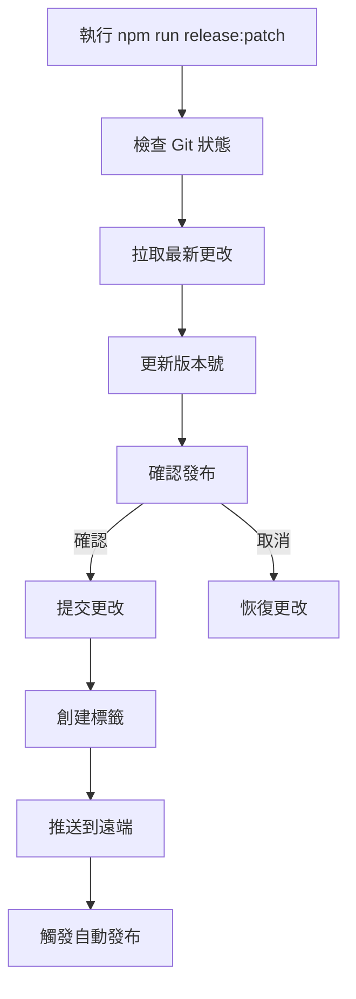

# 版本管理系統

LingUBible 使用自動化版本管理系統，支援自動版本更新、GitHub Releases 整合和動態版本顯示。

## 🚀 功能特色

### 1. **自動版本更新**
- 每次推送到 `main` 分支時自動增加 patch 版本
- 自動創建 Git 標籤和 GitHub Release
- 支援跳過版本更新（在 commit 訊息中添加 `[skip version]`）

### 2. **動態版本顯示**
- 頁腳自動從 GitHub API 獲取最新版本
- 支援點擊版本號跳轉到 GitHub Release 頁面
- 自動區分 Beta 版本（0.x.x）和穩定版本（1.x.x+）

### 3. **手動版本管理**
- 提供手動版本發布工具
- 支援 major、minor、patch 版本更新
- 完整的發布流程自動化

## 📋 版本規則

### Beta 版本（0.x.x）
- 開發階段版本
- 顯示為 "Beta 0.x.x"
- 橙色標籤顯示
- 自動標記為 pre-release

### 穩定版本（1.x.x+）
- 正式發布版本
- 顯示為 "v1.x.x"
- 綠色標籤顯示
- 標記為正式 release

## 🛠️ 使用方法

### 自動版本更新

```bash
# 正常推送到 main 分支，會自動更新版本
git push origin main

# 跳過版本更新
git commit -m "docs: update README [skip version]"
git push origin main
```

### 手動版本管理

```bash
# 增加 patch 版本（0.0.1 → 0.0.2）
npm run release:patch

# 增加 minor 版本（0.0.1 → 0.1.0）
npm run release:minor

# 增加 major 版本（0.0.1 → 1.0.0）
npm run release:major

# 自動發布（跳過確認）
npm run release:auto

# 檢查發布狀態
npm run release:check
```

### 版本資訊查詢

```bash
# 查看當前版本資訊
npm run version:info

# 只更新版本號（不發布）
npm run version:patch
npm run version:minor
npm run version:major
```

## 🔧 技術實現

### 1. GitHub Actions 自動化

**`.github/workflows/auto-version.yml`**
- 監聽 `main` 分支推送
- 自動增加 patch 版本
- 創建 Git 標籤
- 觸發 Release workflow

**`.github/workflows/release.yml`**
- 監聽版本標籤推送
- 自動創建 GitHub Release
- 生成 changelog
- 部署到生產環境

### 2. 前端版本顯示

**`src/services/api/github.ts`**
- GitHub API 整合
- 獲取最新 Release 資訊
- 版本比較和解析

**`src/hooks/useVersion.ts`**
- React Hook 管理版本狀態
- 自動刷新版本資訊
- 錯誤處理和載入狀態

**`src/components/layout/Footer.tsx`**
- 動態版本顯示
- 點擊跳轉到 Release 頁面
- 載入和錯誤狀態指示

### 3. 版本管理工具

**`tools/scripts/version/manual-release.js`**
- 完整的手動發布流程
- Git 狀態檢查
- 互動式確認
- 錯誤恢復機制

## 📊 工作流程

### 自動發布流程

```mermaid
graph TD
    A[推送到 main 分支] --> B{包含 [skip version]?}
    B -->|是| C[跳過版本更新]
    B -->|否| D[自動增加 patch 版本]
    D --> E[提交版本更改]
    E --> F[創建 Git 標籤]
    F --> G[推送標籤]
    G --> H[觸發 Release workflow]
    H --> I[創建 GitHub Release]
    I --> J[自動部署]
```

### 手動發布流程



## 🎯 最佳實踐

### 1. **Commit 訊息規範**
```bash
# 功能更新
git commit -m "feat: add new feature"

# 錯誤修復
git commit -m "fix: resolve login issue"

# 文檔更新（跳過版本）
git commit -m "docs: update API documentation [skip version]"

# 樣式調整（跳過版本）
git commit -m "style: fix button alignment [skip version]"
```

### 2. **版本發布時機**
- **Patch 版本**: 錯誤修復、小幅改進
- **Minor 版本**: 新功能、API 擴展
- **Major 版本**: 重大更改、破壞性變更

### 3. **Release Notes**
- 自動生成基本 changelog
- 手動編輯重要發布的說明
- 包含破壞性變更警告

## 🔍 故障排除

### 常見問題

**1. 自動版本更新失敗**
```bash
# 檢查 GitHub Actions 日誌
# 確認 GITHUB_TOKEN 權限
# 檢查分支保護規則
```

**2. 版本顯示不正確**
```bash
# 檢查 GitHub API 限制
# 確認倉庫名稱設定
# 查看瀏覽器控制台錯誤
```

**3. 手動發布失敗**
```bash
# 確保在 main 分支
# 檢查工作目錄是否乾淨
# 確認 Git 遠端設定
```

### 緊急修復

**回滾版本**
```bash
# 刪除錯誤的標籤
git tag -d v0.0.x
git push origin :refs/tags/v0.0.x

# 恢復到上一個版本
git reset --hard HEAD~1
git push origin main --force
```

**手動創建 Release**
```bash
# 如果自動化失敗，可以手動創建
gh release create v0.0.x --title "Beta 0.0.x" --notes "Manual release"
```

## 📈 監控和分析

### 版本統計
- 發布頻率追蹤
- 版本採用率分析
- 錯誤率監控

### 用戶反饋
- 版本相關問題追蹤
- 功能使用統計
- 性能指標監控

---

**相關文檔**:
- [部署指南](../deployment/)
- [開發環境設定](../setup/)
- [GitHub Actions 設定](../ci-cd/) 