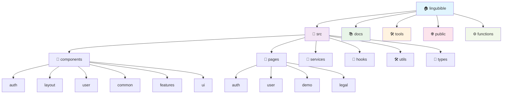

<div align="center">


# 📚 LingUBible

### *让每一个评价，成为学习路上的明灯*

[](../../README.md)
[](../zh-TW/README.md)
[](README.md)

[](https://reactjs.org/)
[](https://www.typescriptlang.org/)
[](https://vitejs.dev/)
[](https://tailwindcss.com/)
[](https://appwrite.io/)

[](https://lingubible.com)
[](https://opensource.org/licenses/MIT)
[](http://makeapullrequest.com)
[](https://github.com/ansonlo-dev/LingUBible/graphs/commit-activity)

[](https://ko-fi.com/lingubible)

---

**🌟 一个专为岭南大学学生打造的课程与讲师评价平台**

*帮助同学们做出明智的学术选择，分享真实的学习体验*

[🚀 立即体验](#-快速开始) • [📖 查看文档](./) • [🤝 参与贡献](#-贡献) • [🌍 多语言支持](#-语言--language)

</div>

---

## 📸 项目预览

<div align="center">

### 🎨 现代化界面设计
*响应式设计，支持深色/浅色主题*

| 🌅 浅色主题 | 🌙 深色主题 |
|:---:|:---:|
|  |  |

### 📱 多设备支持
*桌面、平板、手机完美适配*


### 🎯 核心功能展示

<table>
<tr>
<td align="center" width="20%">

<br><strong>课程评价</strong>
</td>
<td align="center" width="20%">

<br><strong>讲师评分</strong>
</td>
<td align="center" width="20%">

<br><strong>智能搜索</strong>
</td>
<td align="center" width="20%">

<br><strong>多语言支持</strong>
</td>
<td align="center" width="20%">

<br><strong>交互式图表</strong>
</td>
</tr>
</table>

</div>

---

## ✨ 核心功能

<div align="center">

| 功能 | 描述 | 状态 |
|:---:|:---|:---:|
| 📝 **课程评价** | 分享详细的课程学习体验和建议 | ✅ |
| 👨‍🏫 **讲师评分** | 评价教学质量和教学风格 | ✅ |
| 🔍 **智能搜索** | 快速找到课程和讲师信息 | ✅ |
| 🔐 **安全认证** | 学生邮箱验证系统 | ✅ |
| 🌐 **多语言支持** | 英文、繁体中文、简体中文 | ✅ |
| 📱 **响应式设计** | 支持所有设备和屏幕尺寸 | ✅ |
| 🎨 **现代化 UI** | 美观直观的用户界面 | ✅ |
| 🌙 **主题切换** | 深色/浅色主题自由切换 | ✅ |
| 📊 **数据统计** | 个人评价统计和成就系统，配备交互式图表 | ✅ |
| 🔔 **实时通知** | 重要更新和互动提醒 | ✅ |
| ⚡ **高性能表现** | 优化的打包大小和快速加载时间 | ✅ |

</div>

---

## 🛠️ 技术架构

<div align="center">

### 🏗️ 技术栈

<div align="center">

| 类别 | 技术 | 版本 | 用途 |
|:-----|:-----|:-----|:-----|
| **🎨 前端** | React | 18.3.1 | UI 框架 |
| | TypeScript | 5.5.3 | 类型安全 |
| | Vite | 5.4.1 | 构建工具 |
| | Tailwind CSS | 3.4.17 | 样式设计 |
| | shadcn/ui | 最新 | UI 组件 |
| | ECharts | 最新 | 数据可视化与图表 |
| **🔧 后端** | Appwrite | 18.1.1 | BaaS 平台 |
| | 邮件服务 | - | 通信功能 |
| | 身份认证 | - | 用户管理 |
| **📦 工具** | Bun | 最新 | 包管理器与运行时 |
| | ESLint | 最新 | 代码检查 |
| | PostCSS | 最新 | CSS 处理 |
| | i18n | - | 国际化 |

</div>


```mermaid
graph TD
    subgraph "🎨 前端技术栈"
        A[React 18.3.1]
        B[TypeScript 5.5.3]
        C[Vite 5.4.1]
        D[Tailwind CSS]
        E[shadcn/ui]
    end
    
    subgraph "🔧 后端服务"
        F[Appwrite 18.1.1]
        G[邮件服务]
        H[身份认证]
    end
    
    subgraph "📦 开发工具"
        I[ESLint]
        J[PostCSS]
        K[国际化]
    end
    
    style A fill:#61dafb
    style B fill:#3178c6
    style C fill:#646cff
    style D fill:#06b6d4
    style E fill:#000000
    style F fill:#fd366e
    style G fill:#ea4335
    style H fill:#4285f4
    style I fill:#4b32c3
    style J fill:#dd3a0a
    style K fill:#009688
```

### 🏛️ 项目架构


```mermaid
graph TD
    A[🏠 lingubible] --> B[📁 src]
    A --> C[📚 docs]
    A --> D[🛠️ tools]
    A --> E[🌐 public]
    A --> F[⚙️ functions]
    
    B --> B1[🧩 components]
    B --> B2[📄 pages]
    B --> B3[🔧 services]
    B --> B4[🎣 hooks]
    B --> B5[🛠️ utils]
    B --> B6[📝 types]
    
    B1 --> B1A[auth]
    B1 --> B1B[layout]
    B1 --> B1C[user]
    B1 --> B1D[common]
    B1 --> B1E[features]
    B1 --> B1F[ui]
    
    B2 --> B2A[auth]
    B2 --> B2B[user]
    B2 --> B2C[demo]
    B2 --> B2D[legal]
    
    style A fill:#e1f5fe
    style B fill:#f3e5f5
    style C fill:#e8f5e8
    style D fill:#fff3e0
    style E fill:#fce4ec
    style F fill:#f1f8e9
```

<div align="center">

### 📂 目录结构概览

| 目录 | 用途 | 主要组件 |
|:-----|:-----|:---------|
| **📁 src/** | 源代码 | 主要应用程序代码 |
| **├── 🧩 components/** | React 组件 | UI 构建块 |
| **├── 📄 pages/** | 页面组件 | 路由级组件 |
| **├── 🔧 services/** | API 服务 | 外部服务集成 |
| **├── 🎣 hooks/** | 自定义 Hooks | 可重用的 React 逻辑 |
| **├── 🛠️ utils/** | 工具函数 | 辅助函数和常量 |
| **└── 📝 types/** | TypeScript 类型 | 类型定义 |
| **📚 docs/** | 文档 | 项目文档 |
| **🛠️ tools/** | 开发工具 | 构建脚本和工具 |
| **🌐 public/** | 静态资源 | 图片、图标、清单 |
| **⚙️ functions/** | 云函数 | 无服务器函数 |

</div>

### 📊 性能指标

<table align="center">
<tr>
<td align="center">

<br><strong>性能评分</strong>
</td>
<td align="center">

<br><strong>打包大小</strong>
</td>
<td align="center">

<br><strong>加载时间</strong>
</td>
<td align="center">

<br><strong>PWA 支持</strong>
</td>
</tr>
</table>

</div>

---

## ⚡ 性能指标

<div align="center">

### 📊 打包分析与加载时间

| 指标 | 数值 | 状态 |
|:-----|:-----|:-----|
| **📦 打包大小** | ~357KB (gzipped: ~99KB) | 🟢 已优化 |
| **⚡ 初始加载** | < 2s | 🟢 快速 |
| **🔄 热重载** | < 500ms | 🟢 即时 |
| **🏗️ 构建时间** | ~4s | 🟢 快速 |
| **📱 移动设备性能** | 95+ Lighthouse 分数 | 🟢 优秀 |
| **🖥️ 桌面性能** | 98+ Lighthouse 分数 | 🟢 优秀 |

### 🚀 由 Bun 驱动

- **📦 包安装**: 比 npm 快 15 倍
- **⚡ 开发启动**: 比传统工具快 3 倍
- **🔧 构建流程**: 编译速度快 2 倍

</div>

---

## 🚀 快速开始

### 📋 系统要求

- **Node.js**: >= 18.0.0
- **bun**: >= 1.0.0 (快速的 JavaScript 运行时与包管理器)
- **Git**: 最新版本

### ⚡ 为什么选择 Bun？

我们从 npm 迁移到 **Bun** 以提升开发体验：

- 🚀 **闪电般快速**: 包安装速度比 npm 快达 25 倍
- 🔧 **一体化工具**: 运行时、打包器、测试运行器和包管理器
- 📦 **无缝替换**: 与 npm 包和脚本完全兼容
- 🛡️ **内置安全性**: 自动锁定文件验证
- 💾 **高效缓存**: 智能依赖缓存减少安装时间

### ⚡ 快速安装

```bash
# 1️⃣ 克隆项目
git clone https://github.com/ansonlo-dev/LingUBible.git
cd LingUBible

# 2️⃣ 安装依赖
bun install
# 快速且可靠的包管理器

# 3️⃣ 环境配置
cp env.example .env.local

# 4️⃣ 启动开发服务器
bun run dev
# 闪电般快速的开发体验
```

### 🔧 环境配置

<details>
<summary>📝 点击查看详细配置步骤</summary>

1. **复制环境变量模板**
   ```bash
   cp env.example .env.local
   ```

2. **配置必要的环境变量**
   ```env
   # Appwrite 配置
   VITE_APPWRITE_ENDPOINT=your_appwrite_endpoint
   VITE_APPWRITE_PROJECT_ID=your_project_id
   VITE_APPWRITE_DATABASE_ID=your_database_id
   
   # 邮件服务配置
   VITE_EMAIL_SERVICE_ID=your_email_service_id
   
   # 其他配置...
   ```

3. **参考详细设置指南**
   - [📖 完整设置指南](setup/)
   - [🔐 认证配置](setup/authentication.md)
   - [📧 邮件服务设置](setup/email-service.md)

</details>

### 🎯 可用脚本

```bash
# 🚀 开发
bun run dev              # 启动开发服务器
bun run build            # 构建生产版本
bun run preview          # 预览生产构建

# 🔍 代码质量
bun run lint             # 代码检查
bun run refactor:check   # 重构检查

# 📚 文档
bun run docs:structure   # 查看文档结构
bun run project:structure # 查看项目结构

# 🛠️ 工具
bun run docs:setup       # 设置多语言文档
bun run refactor:update-imports # 更新导入路径
bun run readme:generate-assets  # 生成 README 资产
```

---

## 🌍 语言 / Language

<div align="center">

| 语言 | README | 文档 | 状态 |
|:---:|:---:|:---:|:---:|
| **English** | [README.md](../../README.md) | [Documentation](../) | ✅ 完整 |
| **繁體中文** | [README.md](../zh-TW/README.md) | [文檔](../zh-TW/) | ✅ 完整 |
| **简体中文** | [README.md](README.md) | [文档](./) | ✅ 完整 |

</div>

---

## 📖 文档导航

<div align="center">

### 📚 完整文档结构

| 类别 | 内容 | 链接 |
|:---:|:---|:---:|
| 🔧 **设置指南** | 环境配置、依赖安装、部署设置 | [📖 Setup](setup/) |
| ⚡ **功能说明** | 核心功能、API 使用、组件介绍 | [📖 Features](features/) |
| 🚀 **部署指南** | 生产部署、CI/CD、性能优化 | [📖 Deployment](deployment/) |
| 🧪 **测试文档** | 单元测试、集成测试、E2E 测试 | [📖 Testing](testing/) |
| 🛠️ **开发文档** | 架构设计、重构记录、开发规范 | [📖 Development](development/) |

</div>

---

## 🤝 贡献

<div align="center">

### 🌟 欢迎参与贡献！

我们欢迎所有形式的贡献，无论是代码、文档、设计还是想法分享。

[](https://github.com/ansonlo-dev/LingUBible/graphs/contributors)

</div>

### 📝 贡献指南

1. **🍴 Fork 项目**
2. **🌿 创建功能分支** (`git checkout -b feature/AmazingFeature`)
3. **💾 提交更改** (`git commit -m 'Add some AmazingFeature'`)
4. **📤 推送到分支** (`git push origin feature/AmazingFeature`)
5. **🔄 创建 Pull Request**

### 📋 贡献类型

- 🐛 **Bug 修复** - 帮助我们修复问题
- ✨ **新功能** - 添加有用的新功能
- 📝 **文档改进** - 完善项目文档
- 🎨 **UI/UX 改进** - 提升用户体验
- 🌍 **翻译** - 支持更多语言
- 🧪 **测试** - 增加测试覆盖率

### 📖 详细指南

- [Contributing Guide (English)](../CONTRIBUTING.md)
- [貢獻指南 (繁體中文)](../zh-TW/CONTRIBUTING.md)
- [贡献指南 (简体中文)](CONTRIBUTING.md)

---

## 📊 项目统计

<div align="center">


</div>

---

## ❤️ 支持这个项目

<div align="center">

### 🌟 帮助我们让 LingUBible 持续成长！

如果您觉得 **LingUBible** 对您的学习之路有所帮助，请考虑支持我们的开发工作。您的支持帮助我们：

- 🚀 **新增功能** - 持续改进平台
- 🐛 **修复错误** - 维持稳定的使用体验
- 🌍 **扩展语言支持** - 服务更多学生
- 📱 **提升性能** - 优化用户体验
- 🎨 **改善界面** - 打造更美观的界面

### ☕ 请我们喝杯咖啡

<a href="https://ko-fi.com/lingubible" target="_blank">
  
</a>

**每一份贡献，无论多小，都意义重大！🙏**

[](https://ko-fi.com/lingubible)

### 🎯 其他支持方式

- ⭐ **为此仓库点星** - 帮助其他人发现 LingUBible
- 🐛 **报告错误** - 帮助我们改进平台
- 💡 **建议功能** - 与我们分享您的想法
- 📝 **贡献代码** - 加入我们的开发团队
- 🌍 **推广宣传** - 告诉您的朋友关于 LingUBible

</div>

---

## 🏆 致谢

<div align="center">

### 💝 特别感谢

**📚 LingUBible** 的成功离不开以下支持：

| 类别 | 感谢对象 |
|:---:|:---|
| 🛠️ **技术支持** | React、TypeScript、Vite、Tailwind CSS、Appwrite 等开源项目 |
| 🎨 **设计灵感** | shadcn/ui、Radix UI、Lucide Icons 等设计系统 |
| 🌍 **社区支持** | GitHub、Stack Overflow、Reddit 等开发者社区 |
| 🎓 **用户反馈** | 岭南大学学生社群的宝贵意见和建议 |
| ❤️ **开发团队** | 所有贡献者和维护者的辛勤付出 |

### 🌟 开源精神

本项目秉承开源精神，致力于：
- 📖 **知识共享** - 分享技术经验和最佳实践
- 🤝 **社区协作** - 欢迎所有人参与和贡献
- 🚀 **持续改进** - 不断优化和完善功能
- 🌍 **服务社会** - 为教育事业贡献力量

</div>

---

## 📄 许可证

<div align="center">

**📜 MIT 许可证**

本项目采用 [MIT License](../../LICENSE) 开源协议

```
Copyright (c) 2026 LingUBible

Permission is hereby granted, free of charge, to any person obtaining a copy
of this software and associated documentation files (the "Software"), to deal
in the Software without restriction, including without limitation the rights
to use, copy, modify, merge, publish, distribute, sublicense, and/or sell
copies of the Software, and to permit persons to whom the Software is
furnished to do so, subject to the following conditions:

The above copyright notice and this permission notice shall be included in all
copies or substantial portions of the Software.
```

</div>

---

<div align="center">

### 🚀 让我们一起打造更好的学习环境！

**⭐ 如果这个项目对您有帮助，请给我们一个 Star！**

[](https://github.com/ansonlo-dev/LingUBible/stargazers)

---

**🔗 相关链接**

[🌐 官方网站](https://lingubible.com) • 
[📧 联系我们](mailto:contact@ansonlo.dev) • 
[💬 讨论区](https://github.com/ansonlo-dev/LingUBible/discussions) • 
[🐛 问题报告](https://github.com/ansonlo-dev/LingUBible/issues)

---

**⚠️ 免责声明**

本网站与岭南大学无任何官方关联。所有评价和意见均为用户个人观点，不代表岭南大学立场。

---

*Built with ❤️ by [ansonlo.dev](https://ansonlo.dev) | Powered by Open Source*

</div> 