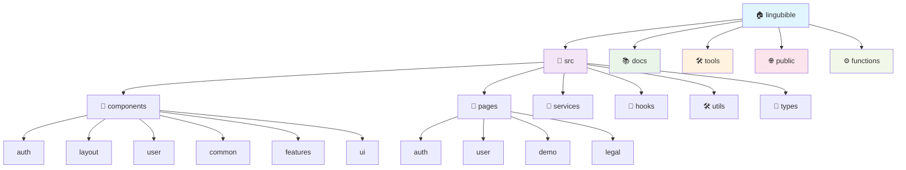

<div align="center">


# 📚 LingUBible

### *讓每一個評價，成為學習路上的明燈*

[](../../README.md)
[](README.md)
[](../zh-CN/README.md)

[](https://reactjs.org/)
[](https://www.typescriptlang.org/)
[](https://vitejs.dev/)
[](https://tailwindcss.com/)
[](https://appwrite.io/)

[](https://lingubible.com)
[](https://opensource.org/licenses/MIT)
[](http://makeapullrequest.com)
[](https://github.com/ansonlo-dev/LingUBible/graphs/commit-activity)

[](https://ko-fi.com/lingubible)

---

**🌟 一個專為嶺南大學學生打造的課程與講師評價平台**

*幫助同學們做出明智的學術選擇，分享真實的學習體驗*

[🚀 立即體驗](#-快速開始) • [📖 查看文檔](./) • [🤝 參與貢獻](#-貢獻) • [🌍 多語言支援](#-語言--language)

</div>

---

## 📸 專案預覽

<div align="center">

### 🎨 現代化介面設計
*響應式設計，支援深色/淺色主題*

| 🌅 淺色主題 | 🌙 深色主題 |
|:---:|:---:|
|  |  |

### 📱 多設備支援
*桌面、平板、手機完美適配*


### 🎯 核心功能展示

<table>
<tr>
<td align="center" width="20%">

<br><strong>課程評價</strong>
</td>
<td align="center" width="20%">

<br><strong>講師評分</strong>
</td>
<td align="center" width="20%">

<br><strong>智慧搜尋</strong>
</td>
<td align="center" width="20%">

<br><strong>多語言支援</strong>
</td>
<td align="center" width="20%">

<br><strong>互動式圖表</strong>
</td>
</tr>
</table>

</div>

---

## ✨ 核心功能

<div align="center">

| 功能 | 描述 | 狀態 |
|:---:|:---|:---:|
| 📝 **課程評價** | 分享詳細的課程學習體驗和建議 | ✅ |
| 👨‍🏫 **講師評分** | 評價教學品質和教學風格 | ✅ |
| 🔍 **智慧搜尋** | 快速找到課程和講師資訊 | ✅ |
| 🔐 **安全認證** | 學生郵箱驗證系統 | ✅ |
| 🌐 **多語言支援** | 英文、繁體中文、簡體中文 | ✅ |
| 📱 **響應式設計** | 支援所有設備和螢幕尺寸 | ✅ |
| 🎨 **現代化 UI** | 美觀直觀的使用者介面 | ✅ |
| 🌙 **主題切換** | 深色/淺色主題自由切換 | ✅ |
| 📊 **數據統計** | 個人評價統計和成就系統，配備互動式圖表 | ✅ |
| 🔔 **即時通知** | 重要更新和互動提醒 | ✅ |
| ⚡ **高效能表現** | 優化的打包大小和快速載入時間 | ✅ |

</div>

---

## 🛠️ 技術架構

<div align="center">

### 🏗️ 技術棧

<div align="center">

| 類別 | 技術 | 版本 | 用途 |
|:-----|:-----|:-----|:-----|
| **🎨 前端** | React | 18.3.1 | UI 框架 |
| | TypeScript | 5.5.3 | 型別安全 |
| | Vite | 5.4.1 | 建構工具 |
| | Tailwind CSS | 3.4.17 | 樣式設計 |
| | shadcn/ui | 最新 | UI 元件 |
| | ECharts | 最新 | 數據視覺化與圖表 |
| **🔧 後端** | Appwrite | 18.1.1 | BaaS 平台 |
| | 郵件服務 | - | 通訊功能 |
| | 身份驗證 | - | 用戶管理 |
| **📦 工具** | Bun | 最新 | 套件管理器與執行環境 |
| | ESLint | 最新 | 程式碼檢查 |
| | PostCSS | 最新 | CSS 處理 |
| | i18n | - | 國際化 |

```mermaid
graph TD
    subgraph "🎨 前端技術棧"
        A[React 18.3.1]
        B[TypeScript 5.5.3]
        C[Vite 5.4.1]
        D[Tailwind CSS]
        E[shadcn/ui]
    end
    
    subgraph "🔧 後端服務"
        F[Appwrite 18.1.1]
        G[郵件服務]
        H[身份驗證]
    end
    
    subgraph "📦 開發工具"
        I[ESLint]
        J[PostCSS]
        K[國際化]
    end
    
    style A fill:#61dafb
    style B fill:#3178c6
    style C fill:#646cff
    style D fill:#06b6d4
    style E fill:#000000
    style F fill:#fd366e
    style G fill:#ea4335
    style H fill:#4285f4
    style I fill:#4b32c3
    style J fill:#dd3a0a
    style K fill:#009688
```

</div>



### 🏛️ 專案架構



<div align="center">

### 📂 目錄結構概覽

| 目錄 | 用途 | 主要組件 |
|:-----|:-----|:---------|
| **📁 src/** | 原始碼 | 主要應用程式碼 |
| **├── 🧩 components/** | React 元件 | UI 建構模塊 |
| **├── 📄 pages/** | 頁面元件 | 路由級元件 |
| **├── 🔧 services/** | API 服務 | 外部服務整合 |
| **├── 🎣 hooks/** | 自訂 Hooks | 可重用的 React 邏輯 |
| **├── 🛠️ utils/** | 工具函數 | 輔助函數和常量 |
| **└── 📝 types/** | TypeScript 型別 | 型別定義 |
| **📚 docs/** | 文檔 | 專案文檔 |
| **🛠️ tools/** | 開發工具 | 建構腳本和工具 |
| **🌐 public/** | 靜態資源 | 圖片、圖標、清單 |
| **⚙️ functions/** | 雲端函數 | 無伺服器函數 |

</div>

### 📊 效能指標

<table align="center">
<tr>
<td align="center">

<br><strong>效能評分</strong>
</td>
<td align="center">

<br><strong>打包大小</strong>
</td>
<td align="center">

<br><strong>載入時間</strong>
</td>
<td align="center">

<br><strong>PWA 支援</strong>
</td>
</tr>
</table>

</div>

---

## ⚡ 效能指標

<div align="center">

### 📊 打包分析與載入時間

| 指標 | 數值 | 狀態 |
|:-----|:-----|:-----|
| **📦 打包大小** | ~357KB (gzipped: ~99KB) | 🟢 已優化 |
| **⚡ 初始載入** | < 2s | 🟢 快速 |
| **🔄 熱重載** | < 500ms | 🟢 即時 |
| **🏗️ 建置時間** | ~4s | 🟢 快速 |
| **📱 行動裝置效能** | 95+ Lighthouse 分數 | 🟢 優秀 |
| **🖥️ 桌面效能** | 98+ Lighthouse 分數 | 🟢 優秀 |

### 🚀 由 Bun 驅動

- **📦 套件安裝**: 比 npm 快 15 倍
- **⚡ 開發啟動**: 比傳統工具快 3 倍
- **🔧 建置流程**: 編譯速度快 2 倍

</div>

---

## 🚀 快速開始

### 📋 系統需求

- **Node.js**: >= 18.0.0
- **bun**: >= 1.0.0 (快速的 JavaScript 執行環境與套件管理器)
- **Git**: 最新版本

### ⚡ 為什麼選擇 Bun？

我們從 npm 遷移到 **Bun** 以提升開發體驗：

- 🚀 **閃電般快速**: 套件安裝速度比 npm 快達 25 倍
- 🔧 **一體化工具**: 執行環境、打包器、測試執行器和套件管理器
- 📦 **無縫替換**: 與 npm 套件和腳本完全相容
- 🛡️ **內建安全性**: 自動鎖定檔案驗證
- 💾 **高效快取**: 智慧相依性快取減少安裝時間

### ⚡ 快速安裝

```bash
# 1️⃣ 複製專案
git clone https://github.com/ansonlo-dev/LingUBible.git
cd LingUBible

# 2️⃣ 安裝相依性
bun install
# 快速且可靠的套件管理器

# 3️⃣ 環境設定
cp env.example .env.local

# 4️⃣ 啟動開發伺服器
bun run dev
# 閃電般快速的開發體驗
```

### 🔧 環境設定

<details>
<summary>📝 點擊查看詳細設定步驟</summary>

1. **複製環境變數範本**
   ```bash
   cp env.example .env.local
   ```

2. **設定必要的環境變數**
   ```env
   # Appwrite 設定
   VITE_APPWRITE_ENDPOINT=your_appwrite_endpoint
   VITE_APPWRITE_PROJECT_ID=your_project_id
   VITE_APPWRITE_DATABASE_ID=your_database_id
   
   # 郵件服務設定
   VITE_EMAIL_SERVICE_ID=your_email_service_id
   
   # 其他設定...
   ```

3. **參考詳細設定指南**
   - [📖 完整設定指南](setup/)
   - [🔐 認證設定](setup/authentication.md)
   - [📧 郵件服務設定](setup/email-service.md)

</details>

### 🎯 可用指令

```bash
# 🚀 開發
bun run dev              # 啟動開發伺服器
bun run build            # 建置正式版本
bun run preview          # 預覽正式建置

# 🔍 程式碼品質
bun run lint             # 程式碼檢查
bun run refactor:check   # 重構檢查

# 📚 文檔
bun run docs:structure   # 查看文檔結構
bun run project:structure # 查看專案結構

# 🛠️ 工具
bun run docs:setup       # 設定多語言文檔
bun run refactor:update-imports # 更新匯入路徑
bun run readme:generate-assets  # 產生 README 資源
```

---

## 🌍 語言 / Language

<div align="center">

| 語言 | README | 文檔 | 狀態 |
|:---:|:---:|:---:|:---:|
| **English** | [README.md](../../README.md) | [Documentation](../) | ✅ 完整 |
| **繁體中文** | [README.md](README.md) | [文檔](./) | ✅ 完整 |
| **简体中文** | [README.md](../zh-CN/README.md) | [文档](../zh-CN/) | ✅ 完整 |

</div>

---

## 📖 文檔導覽

<div align="center">

### 📚 完整文檔結構

| 類別 | 內容 | 連結 |
|:---:|:---|:---:|
| 🔧 **設定指南** | 環境設定、相依性安裝、部署設定 | [📖 Setup](setup/) |
| ⚡ **功能說明** | 核心功能、API 使用、元件介紹 | [📖 Features](features/) |
| 🚀 **部署指南** | 正式部署、CI/CD、效能最佳化 | [📖 Deployment](deployment/) |
| 🧪 **測試文檔** | 單元測試、整合測試、E2E 測試 | [📖 Testing](testing/) |
| 🛠️ **開發文檔** | 架構設計、重構記錄、開發規範 | [📖 Development](development/) |

</div>

---

## 🤝 貢獻

<div align="center">

### 🌟 歡迎參與貢獻！

我們歡迎所有形式的貢獻，無論是程式碼、文檔、設計還是想法分享。

[](https://github.com/ansonlo-dev/LingUBible/graphs/contributors)

</div>

### 📝 貢獻指南

1. **🍴 Fork 專案**
2. **🌿 建立功能分支** (`git checkout -b feature/AmazingFeature`)
3. **💾 提交變更** (`git commit -m 'Add some AmazingFeature'`)
4. **📤 推送到分支** (`git push origin feature/AmazingFeature`)
5. **🔄 建立 Pull Request**

### 📋 貢獻類型

- 🐛 **Bug 修復** - 幫助我們修復問題
- ✨ **新功能** - 新增有用的新功能
- 📝 **文檔改進** - 完善專案文檔
- 🎨 **UI/UX 改進** - 提升使用者體驗
- 🌍 **翻譯** - 支援更多語言
- 🧪 **測試** - 增加測試覆蓋率

### 📖 詳細指南

- [Contributing Guide (English)](../CONTRIBUTING.md)
- [貢獻指南 (繁體中文)](CONTRIBUTING.md)
- [贡献指南 (简体中文)](../zh-CN/CONTRIBUTING.md)

---

## 📊 專案統計

<div align="center">


</div>

---

## ❤️ 支持這個專案

<div align="center">

### 🌟 幫助我們讓 LingUBible 持續成長！

如果您覺得 **LingUBible** 對您的學習之路有所幫助，請考慮支持我們的開發工作。您的支持幫助我們：

- 🚀 **新增功能** - 持續改進平台
- 🐛 **修復錯誤** - 維持穩定的使用體驗
- 🌍 **擴展語言支援** - 服務更多學生
- 📱 **提升效能** - 最佳化使用者體驗
- 🎨 **改善介面** - 打造更美觀的界面

### ☕ 請我們喝杯咖啡

<a href="https://ko-fi.com/lingubible" target="_blank">
  
</a>

**每一份貢獻，無論多小，都意義重大！🙏**

[](https://ko-fi.com/lingubible)

### 🎯 其他支持方式

- ⭐ **為此儲存庫按星** - 幫助其他人發現 LingUBible
- 🐛 **回報錯誤** - 幫助我們改進平台
- 💡 **建議功能** - 與我們分享您的想法
- 📝 **貢獻程式碼** - 加入我們的開發團隊
- 🌍 **推廣宣傳** - 告訴您的朋友關於 LingUBible

</div>

---

## 🏆 致謝

<div align="center">

### 💝 特別感謝

**📚 LingUBible** 的成功離不開以下支持：

| 類別 | 感謝對象 |
|:---:|:---|
| 🛠️ **技術支援** | React、TypeScript、Vite、Tailwind CSS、Appwrite 等開源專案 |
| 🎨 **設計靈感** | shadcn/ui、Radix UI、Lucide Icons 等設計系統 |
| 🌍 **社群支援** | GitHub、Stack Overflow、Reddit 等開發者社群 |
| 🎓 **使用者回饋** | 嶺南大學學生社群的寶貴意見和建議 |
| ❤️ **開發團隊** | 所有貢獻者和維護者的辛勤付出 |

### 🌟 開源精神

本專案秉承開源精神，致力於：
- 📖 **知識共享** - 分享技術經驗和最佳實務
- 🤝 **社群協作** - 歡迎所有人參與和貢獻
- 🚀 **持續改進** - 不斷最佳化和完善功能
- 🌍 **服務社會** - 為教育事業貢獻力量

</div>

---

## 📄 授權

<div align="center">

**📜 MIT 授權**

本專案採用 [MIT License](../../LICENSE) 開源協議

```
Copyright (c) 2025 LingUBible

Permission is hereby granted, free of charge, to any person obtaining a copy
of this software and associated documentation files (the "Software"), to deal
in the Software without restriction, including without limitation the rights
to use, copy, modify, merge, publish, distribute, sublicense, and/or sell
copies of the Software, and to permit persons to whom the Software is
furnished to do so, subject to the following conditions:

The above copyright notice and this permission notice shall be included in all
copies or substantial portions of the Software.
```

</div>

---

<div align="center">

### 🚀 讓我們一起打造更好的學習環境！

**⭐ 如果這個專案對您有幫助，請給我們一個 Star！**

[](https://github.com/ansonlo-dev/LingUBible/stargazers)

---

**🔗 相關連結**

[🌐 官方網站](https://lingubible.com) • 
[📧 聯絡我們](mailto:contact@ansonlo.dev) • 
[💬 討論區](https://github.com/ansonlo-dev/LingUBible/discussions) • 
[🐛 問題回報](https://github.com/ansonlo-dev/LingUBible/issues)

---

**⚠️ 免責聲明**

本網站與嶺南大學無任何官方關聯。所有評價和意見均為使用者個人觀點，不代表嶺南大學立場。

---

*Built with ❤️ by [ansonlo.dev](https://ansonlo.dev) | Powered by Open Source*

</div> 