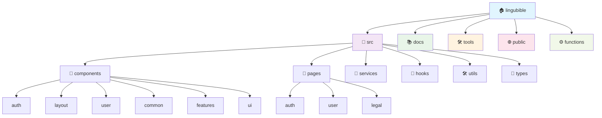

<div align="center">


# 📚 LingUBible

### *讓每一個評價，成為學習路上的明燈*

[](../../README.md)
[](README.md)
[](../zh-CN/README.md)

[](https://reactjs.org/)
[](https://www.typescriptlang.org/)
[](https://vitejs.dev/)
[](https://tailwindcss.com/)
[](https://appwrite.io/)
[](https://echarts.apache.org/)

[](https://lingubible.com)
[](https://opensource.org/licenses/MIT)
[](http://makeapullrequest.com)
[](https://github.com/ansonlo-dev/LingUBible/graphs/commit-activity)

[](https://ko-fi.com/lingubible)

---

**🌟 一個專為嶺南大學學生打造的課程與講師評價平台**

*幫助同學們做出明智的學術選擇，分享真實的學習體驗*

[🚀 立即體驗](#-快速開始) • [📖 查看文檔](./) • [🤝 參與貢獻](#-貢獻) • [🌍 多語言支援](#-語言--language)

</div>

---

## 🌐 線上體驗

<div align="center">

**LingUBible 已正式上線，服務嶺南大學學生：**

### [🔗 lingubible.com](https://lingubible.com)

*瀏覽課程與講師、閱讀及撰寫評價、探索互動式成績分佈——無需安裝。註冊需使用有效的嶺南大學電子郵件。*

</div>

---

## ✨ 核心功能

<div align="center">

| 功能 | 描述 | 狀態 |
|:---:|:---|:---:|
| 📝 **課程評價** | 涵蓋工作量、難度、成績與教學的詳細評價，並可投票標記是否有用 | ✅ |
| 👨‍🏫 **講師評價** | 依授課形式（講課／導修）分別呈現各講師評分 | ✅ |
| 📊 **互動式成績圖表** | 以長條圖、堆疊圖、箱形圖呈現成績分佈（ECharts），附累積百分比線、GPA 與 N/A 切換 | ✅ |
| 📄 **歷屆試題** | 依學年與講師瀏覽、排序、篩選歷屆試題，並支援多選批次 ZIP 下載 | ✅ |
| 📑 **課程大綱** | 直接於課程頁面檢視最新課程大綱 | ✅ |
| ⭐ **收藏** | 收藏喜愛的課程與講師以便快速存取 | ✅ |
| 🔍 **智慧搜尋** | 快速搜尋課程與講師，並支援講師暱稱比對 | ✅ |
| 🏛️ **學院與學系徽章** | 支援課程與講師的多學系標示 | ✅ |
| 🔐 **學生驗證** | 嶺南電郵驗證、Google OAuth 與 reCAPTCHA 防護 | ✅ |
| 🌐 **多語言支援** | 英文、繁體中文、簡體中文 | ✅ |
| 📈 **個人統計** | 個人儀表板，呈現你的評價紀錄與獲得的票數 | ✅ |
| 📱 **PWA 與響應式** | 可安裝的漸進式網頁應用，適配各種螢幕尺寸 | ✅ |
| 🌙 **主題切換** | 深色／淺色主題無縫切換 | ✅ |

</div>

---

## 🛠️ 技術架構

<div align="center">

### 🏗️ 技術棧

<div align="center">

| 類別 | 技術 | 版本 | 用途 |
|:-----|:-----|:-----|:-----|
| **🎨 前端** | React | 18.3.1 | UI 框架 |
| | TypeScript | 5.5.3 | 型別安全 |
| | Vite | 7.0.0 | 建構工具 |
| | Tailwind CSS | 3.4.17 | 樣式設計 |
| | shadcn/ui · Radix UI | 最新 | UI 元件 |
| | ECharts | 5.6.0 | 數據視覺化與圖表 |
| | React Router | 6.26.2 | 路由 |
| | TanStack Query | 5.56.2 | 資料擷取與快取 |
| | Zod | 3.23.8 | 結構驗證 |
| **🔧 後端** | Appwrite | 19.0.0 | BaaS（認證、TablesDB、儲存、函數） |
| | Resend | - | 交易型郵件 |
| | Google reCAPTCHA v3 | - | 機器人防護 |
| **📦 工具** | Bun | 最新 | 套件管理器與執行環境 |
| | ESLint | 最新 | 程式碼檢查 |
| | PostCSS | 最新 | CSS 處理 |
| | 自製 i18n | - | 國際化 |

</div>


```mermaid
graph TD
    subgraph "🎨 前端技術棧"
        A[React 18.3.1]
        B[TypeScript 5.5.3]
        C[Vite 7.0.0]
        D[Tailwind CSS]
        E[shadcn/ui]
    end
    
    subgraph "🔧 後端服務"
        F[Appwrite 19.0.0]
        G[Resend 郵件]
        H[認證與 TablesDB]
    end
    
    subgraph "📦 開發工具"
        I[ESLint]
        J[PostCSS]
        K[國際化]
    end
    
    style A fill:#61dafb
    style B fill:#3178c6
    style C fill:#646cff
    style D fill:#06b6d4
    style E fill:#000000
    style F fill:#fd366e
    style G fill:#ea4335
    style H fill:#4285f4
    style I fill:#4b32c3
    style J fill:#dd3a0a
    style K fill:#009688
```

### 🏛️ 專案架構


```mermaid
graph TD
    A[🏠 lingubible] --> B[📁 src]
    A --> C[📚 docs]
    A --> D[🛠️ tools]
    A --> E[🌐 public]
    A --> F[⚙️ functions]
    
    B --> B1[🧩 components]
    B --> B2[📄 pages]
    B --> B3[🔧 services]
    B --> B4[🎣 hooks]
    B --> B5[🛠️ utils]
    B --> B6[📝 types]
    
    B1 --> B1A[auth]
    B1 --> B1B[layout]
    B1 --> B1C[user]
    B1 --> B1D[common]
    B1 --> B1E[features]
    B1 --> B1F[ui]
    
    B2 --> B2A[auth]
    B2 --> B2B[user]
    B2 --> B2D[legal]
    
    style A fill:#e1f5fe
    style B fill:#f3e5f5
    style C fill:#e8f5e8
    style D fill:#fff3e0
    style E fill:#fce4ec
    style F fill:#f1f8e9
```

<div align="center">

### 📂 目錄結構概覽

| 目錄 | 用途 | 主要組件 |
|:-----|:-----|:---------|
| **📁 src/** | 原始碼 | 主要應用程式碼 |
| **├── 🧩 components/** | React 元件 | UI 建構模塊 |
| **├── 📄 pages/** | 頁面元件 | 路由級元件 |
| **├── 🔧 services/** | API 服務 | 外部服務整合 |
| **├── 🎣 hooks/** | 自訂 Hooks | 可重用的 React 邏輯 |
| **├── 🛠️ utils/** | 工具函數 | 輔助函數和常量 |
| **└── 📝 types/** | TypeScript 型別 | 型別定義 |
| **📚 docs/** | 文檔 | 專案文檔 |
| **🛠️ tools/** | 開發工具 | 建構腳本和工具 |
| **🌐 public/** | 靜態資源 | 圖片、圖標、清單 |
| **⚙️ functions/** | 雲端函數 | 無伺服器函數 |

</div>

</div>

---

## ⚡ 效能與最佳化

<div align="center">

LingUBible 經過調校，在 Appwrite 基礎架構上維持快速且流暢的體驗。

</div>

- **🧩 程式碼分割** — vendor、UI、圖表與語系程式碼拆分為獨立 chunk，讓初始載入更精簡，較少用到的程式碼按需載入。
- **🗂️ 被動多層快取** — 以記憶體 + `localStorage` 寫穿式 TTL 快取支撐繁重的彙總讀取（授課記錄、學期／語言統計），重訪即時呈現且不進行任何背景輪詢。
- **🔤 字型子集化** — 於建置時對 LXGW 文楷 CJK 字型做子集化，只內嵌實際使用到的字符。
- **🌍 語系延遲載入** — 每個語言包僅在選用時才動態載入。
- **⚡ Bun + Vite 7** — 安裝快速、開發啟動近乎即時，熱模組替換（HMR）反應靈敏。

---

## 🚀 快速開始

### 📋 系統需求

- **Node.js**: >= 20.19.0（Vite 7 所需）
- **bun**: >= 1.0.0（快速的 JavaScript 執行環境與套件管理器）
- **Git**: 最新版本

### ⚡ 為什麼選擇 Bun？

我們從 npm 遷移到 **Bun** 以提升開發體驗：

- 🚀 **閃電般快速**: 套件安裝速度比 npm 快達 25 倍
- 🔧 **一體化工具**: 執行環境、打包器、測試執行器和套件管理器
- 📦 **無縫替換**: 與 npm 套件和腳本完全相容
- 🛡️ **內建安全性**: 自動鎖定檔案驗證
- 💾 **高效快取**: 智慧相依性快取減少安裝時間

### ⚡ 快速安裝

```bash
# 1️⃣ 複製專案
git clone https://github.com/ansonlo-dev/LingUBible.git
cd LingUBible

# 2️⃣ 安裝相依性
bun install
# 快速且可靠的套件管理器

# 3️⃣ 環境設定
cp env.example .env.local

# 4️⃣ 啟動開發伺服器
bun run dev
# 閃電般快速的開發體驗
```

### 🔧 環境設定

<details>
<summary>📝 點擊查看詳細設定步驟</summary>

1. **複製環境變數範本**
   ```bash
   cp env.example .env.local
   ```

2. **設定必要的環境變數**
   ```env
   # 前端（Appwrite 客戶端）
   VITE_APPWRITE_ENDPOINT=your_appwrite_endpoint
   VITE_APPWRITE_PROJECT_ID=your_project_id

   # 前端（Google reCAPTCHA v3 — 公開網站金鑰）
   VITE_RECAPTCHA_SITE_KEY=your_recaptcha_site_key

   # 開發模式：允許任何電郵註冊（生產環境切勿開啟）
   VITE_DEV_MODE=false

   # 伺服器端／雲端函數（請妥善保密）
   APPWRITE_API_KEY=your_appwrite_api_key
   RESEND_API_KEY=your_resend_api_key
   RECAPTCHA_SECRET_KEY=your_recaptcha_secret_key
   ```

3. **參考詳細設定指南**
   - [📖 設定指南](setup/)
   - [🔑 環境變數](setup/ENVIRONMENT_VARIABLES_SETUP.md)
   - [🎓 學生電郵驗證](setup/STUDENT_EMAIL_VERIFICATION_SETUP.md)
   - [🛡️ reCAPTCHA 設定](../setup/RECAPTCHA_SETUP.md)

</details>

### 🎯 可用指令

```bash
# 🚀 開發
bun run dev              # 啟動開發伺服器（:8080，已啟用 --host）
bun run build            # 正式建置（輸出：dist/）
bun run build:fast       # 正式建置，略過字型子集化
bun run preview          # 預覽正式建置

# 🔍 程式碼品質
bun run lint             # ESLint
bun run refactor:check   # 建置 + 健全性檢查（「我有沒有改壞？」）

# ☁️ 後端
bun run deploy:functions # 部署 Appwrite 雲端函數

# 🔤 字型與工具
bun run fonts:rebuild    # 重新對 LXGW 文楷字型做子集化
bun run project:structure # 印出 src/ 目錄樹
```

> **部署：** 前端透過 Appwrite ↔ GitHub 整合自動部署至 **Appwrite Sites**——推送到 `main` 即觸發建置。雲端函數則以 `bun run deploy:functions` 另行部署。

---

## 🌍 語言 / Language

<div align="center">

| 語言 | README | 文檔 | 狀態 |
|:---:|:---:|:---:|:---:|
| **English** | [README.md](../../README.md) | [Documentation](../) | ✅ 完整 |
| **繁體中文** | [README.md](README.md) | [文檔](./) | ✅ 完整 |
| **简体中文** | [README.md](../zh-CN/README.md) | [文档](../zh-CN/) | ✅ 完整 |

</div>

---

## 📖 文檔導覽

<div align="center">

### 📚 完整文檔結構

| 類別 | 內容 | 連結 |
|:---:|:---|:---:|
| 🔧 **設定指南** | 環境變數、開發模式、電郵驗證、reCAPTCHA | [📖 Setup](setup/) |
| ⚡ **功能說明** | 頭像系統、多語言實作、郵件範本、安全性 | [📖 Features](features/) |
| 🚀 **部署指南** | Appwrite Sites Git 部署 | [📖 Deployment](deployment/) |
| 🛠️ **開發文檔** | 專案結構、Bun-only 設定、函數分析 | [📖 Development](../development/) |

</div>

---

## 🤝 貢獻

<div align="center">

### 🌟 歡迎參與貢獻！

我們歡迎所有形式的貢獻，無論是程式碼、文檔、設計還是想法分享。

[](https://github.com/ansonlo-dev/LingUBible/graphs/contributors)

</div>

### 📝 貢獻指南

1. **🍴 Fork 專案**
2. **🌿 建立功能分支** (`git checkout -b feature/AmazingFeature`)
3. **💾 提交變更** (`git commit -m 'Add some AmazingFeature'`)
4. **📤 推送到分支** (`git push origin feature/AmazingFeature`)
5. **🔄 建立 Pull Request**

### 📋 貢獻類型

- 🐛 **Bug 修復** - 幫助我們修復問題
- ✨ **新功能** - 新增有用的新功能
- 📝 **文檔改進** - 完善專案文檔
- 🎨 **UI/UX 改進** - 提升使用者體驗
- 🌍 **翻譯** - 支援更多語言
- 🧪 **測試** - 增加測試覆蓋率

### 📖 詳細指南

- [📖 貢獻指南](../CONTRIBUTING.md)

---

## 📊 專案統計

<div align="center">


</div>

---

## ❤️ 支持這個專案

<div align="center">

### 🌟 幫助我們讓 LingUBible 持續成長！

如果您覺得 **LingUBible** 對您的學習之路有所幫助，請考慮支持我們的開發工作。您的支持幫助我們：

- 🚀 **新增功能** - 持續改進平台
- 🐛 **修復錯誤** - 維持穩定的使用體驗
- 🌍 **擴展語言支援** - 服務更多學生
- 📱 **提升效能** - 最佳化使用者體驗
- 🎨 **改善介面** - 打造更美觀的界面

### ☕ 請我們喝杯咖啡

<a href="https://ko-fi.com/lingubible" target="_blank">
  
</a>

**每一份貢獻，無論多小，都意義重大！🙏**

[](https://ko-fi.com/lingubible)

### 🎯 其他支持方式

- ⭐ **為此儲存庫按星** - 幫助其他人發現 LingUBible
- 🐛 **回報錯誤** - 幫助我們改進平台
- 💡 **建議功能** - 與我們分享您的想法
- 📝 **貢獻程式碼** - 加入我們的開發團隊
- 🌍 **推廣宣傳** - 告訴您的朋友關於 LingUBible

</div>

---

## 🏆 致謝

<div align="center">

### 💝 特別感謝

**📚 LingUBible** 的成功離不開以下支持：

| 類別 | 感謝對象 |
|:---:|:---|
| 🛠️ **技術支援** | React、TypeScript、Vite、Tailwind CSS、Appwrite 等開源專案 |
| 🎨 **設計靈感** | shadcn/ui、Radix UI、Lucide Icons 等設計系統 |
| 🌍 **社群支援** | GitHub、Stack Overflow、Reddit 等開發者社群 |
| 🎓 **使用者回饋** | 嶺南大學學生社群的寶貴意見和建議 |
| ❤️ **開發團隊** | 所有貢獻者和維護者的辛勤付出 |

### 🌟 開源精神

本專案秉承開源精神，致力於：
- 📖 **知識共享** - 分享技術經驗和最佳實務
- 🤝 **社群協作** - 歡迎所有人參與和貢獻
- 🚀 **持續改進** - 不斷最佳化和完善功能
- 🌍 **服務社會** - 為教育事業貢獻力量

</div>

---

## 📄 授權

<div align="center">

**📜 MIT 授權**

本專案採用 [MIT License](../../LICENSE) 開源協議

```
Copyright (c) 2026 LingUBible

Permission is hereby granted, free of charge, to any person obtaining a copy
of this software and associated documentation files (the "Software"), to deal
in the Software without restriction, including without limitation the rights
to use, copy, modify, merge, publish, distribute, sublicense, and/or sell
copies of the Software, and to permit persons to whom the Software is
furnished to do so, subject to the following conditions:

The above copyright notice and this permission notice shall be included in all
copies or substantial portions of the Software.
```

</div>

---

<div align="center">

### 🚀 讓我們一起打造更好的學習環境！

**⭐ 如果這個專案對您有幫助，請給我們一個 Star！**

[](https://github.com/ansonlo-dev/LingUBible/stargazers)

---

**🔗 相關連結**

[🌐 官方網站](https://lingubible.com) • 
[📧 聯絡我們](mailto:contact@ansonlo.dev) • 
[💬 討論區](https://github.com/ansonlo-dev/LingUBible/discussions) • 
[🐛 問題回報](https://github.com/ansonlo-dev/LingUBible/issues)

---

**⚠️ 免責聲明**

本網站與嶺南大學無任何官方關聯。所有評價和意見均為使用者個人觀點，不代表嶺南大學立場。

---

*Built with ❤️ by [ansonlo.dev](https://ansonlo.dev) | Powered by Open Source*

</div> 